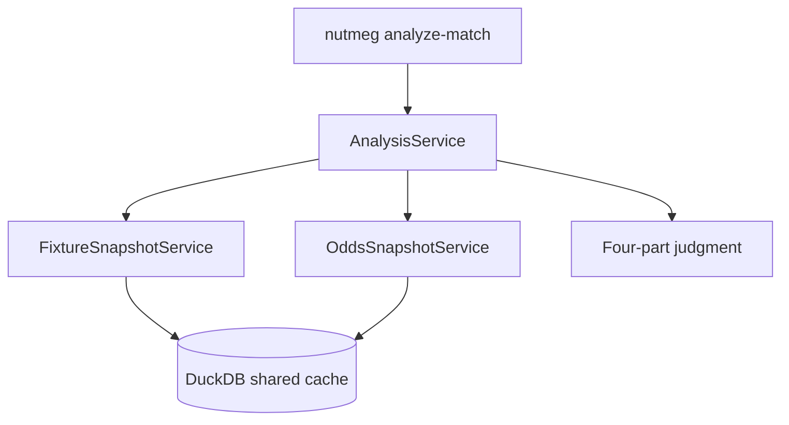

# Analysis Judgment v0

This document describes Nutmeg's first agent-facing analysis path.

## Goal

Turn the existing pre-match snapshot and odds snapshot services into one direct,
operator-facing judgment workflow.

The first slice is intentionally deterministic. It does not require LangGraph or
live LLM orchestration yet. The purpose is to prove the synthesis boundary,
output contract, and truthfulness rules before a more model-driven agent layer is
added.

## Flow

## Contract

The analysis path always returns four judgment fields:

- `judgment`
- `core_reasons`
- `counterargument`
- `confidence`

It also returns an evidence summary that keeps snapshot-derived and odds-derived
signals distinct.

## Truthfulness rules

- Missing odds must remain explicit; the analysis cannot invent market support.
- Informational queries do not automatically become direct betting calls.
- If evidence is too thin for a meaningful judgment, the workflow fails clearly
  instead of bluffing confidence.

## Why this slice exists now

Sprint 1 already delivered shared fixture context and market context. This slice
is the smallest step that turns those data paths into an actual assistant-like
workflow while keeping implementation risk low.
