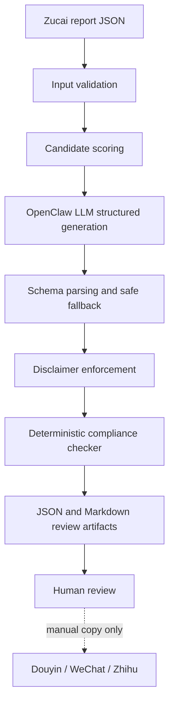

# Content Publisher

Content Publisher v0 turns existing Nutmeg/Zucai analysis artifacts into compliant, human-reviewable sports-analysis drafts. It is a publisher layer, not a betting workflow and not an external-platform posting bot.

## Workflow



## Module Boundaries

- `nutmeg.services.zucai` owns traditional足彩 issue reports, recommendations, plans, and report JSON.
- `nutmeg.services.content` owns content topic selection, LLM prompting/parsing, compliance checks, and review artifact rendering.
- `nutmeg.interfaces.cli content-pack` is the operator and future OpenClaw/router contract.
- v0 does not post to Douyin, WeChat, Zhihu, Xiaohongshu, private groups, or any betting platform.

## Reliability Gates

1. **Input validation**: `content-pack` requires a readable Zucai report JSON with `issue.matches` and `recommendations`.
2. **Candidate scoring**: each match gets explicit `attention_score`, `content_score`, `model_stability_score`, `compliance_score`, `final_content_priority`, and `selection_reason`.
3. **LLM provider seam**: live mode calls `openclaw infer model run --json --model nyu-openai-chat/gpt-5.5`. Tests use fake or deterministic providers and do not call live LLMs.
4. **Schema gate**: LLM output must parse as JSON with titles, short script, and long article. Invalid output becomes a conservative fallback draft with warnings.
5. **Disclaimer gate**: short-video and long-form disclaimers are appended before final compliance assessment.
6. **Compliance gate**: local deterministic rules classify `LOW`, `MEDIUM`, `HIGH`, or `BLOCKED`; publishing advice is `publish`, `review`, or `skip`.
7. **Artifact gate**: JSON/Markdown outputs are review artifacts. They are not external publication actions.

## Compliance Semantics

- `LOW`: sports/data/rules analysis with disclaimers and no result-driving language; may enter publish queue.
- `MEDIUM`: includes model/odds/market/result tendency, but balanced by uncertainty and disclaimers; requires human review.
- `HIGH`: includes high-certainty or stimulus terms such as 稳胆、红单、确定性很强; skip and rewrite.
- `BLOCKED`: includes betting instructions, profit claims, private-group/paid-plan lead-ins, or betting-platform lead-ins; skip and do not one-click approve.

Disclaimers do not reduce `BLOCKED` content. If text says `买主胜` or `私信拿单`, the final risk remains `BLOCKED` even when a disclaimer is present.

## CLI

```bash
uv run nutmeg content-pack \
  --report-file nutmeg/content/samples/26068-content-report.json \
  --limit 1 \
  --output-dir .nutmeg-data/content-smoke \
  --llm-mode deterministic \
  --format json

uv run nutmeg content-pack \
  --report-file .nutmeg-data/zucai/zucai-26068-report.json \
  --limit 3 \
  --output-dir .nutmeg-data/content \
  --llm-mode openclaw \
  --openclaw-model nyu-openai-chat/gpt-5.5 \
  --format json
```

## Future Seams

- Platform-specific pack adapters can map the same `ContentPack` to Douyin captions, WeChat articles, Zhihu Q&A, Xiaohongshu cards, or website archives.
- A future reviewer loop can ask OpenClaw to rewrite `HIGH` packs, but the deterministic compliance gate should remain the final local check.
- A future router action can wrap `content-pack` without duplicating content logic inside OpenClaw.

## Daily Match Video Content Extension

`daily-content-pack` extends the content layer from report-level drafts into per-match video production packages for竞彩足球 slates. It reuses the same responsible-use posture: internal analysis may include odds and JCZQ lean, while public scripts must stay as sports analysis and market-expectation commentary.

The workflow writes review artifacts first and never submits video jobs by itself. Each match package includes a public-safe 60-second script, storyboard segments, vertical `9:16` Seedance prompts, horizontal `16:9` backup prompts, compliance results, and a per-match folder with analysis/script/storyboard/prompt JSON files. `HIGH` or `BLOCKED` public scripts keep their internal analysis but are excluded from the Seedance manifest until rewritten.

The default animation profile is `retro-football-manga-v3.1`. Its production factors are part of the manifest, not just design notes: first-two-second hook, vertical readability, fixed series packaging, character continuity, refined cel-animation craft, Douyin/Xiaohongshu output split, and compliance constraints. The canonical style assets live in `docs/style-assets/retro-football-manga-v3.1/`, and each run writes per-match `production-factors.json` so reviewers can verify which factors influenced the generated prompts.

Real video generation moves through `seedance-submit --confirm` and `seedance-poll`, keeping external paid actions outside the content generation step. Submission defaults to vertical tasks only; horizontal prompts remain available for later compilation. `seedance-poll --download --concat` can download completed MP4 segments and attempt local ffmpeg concatenation into a final vertical video per match.
