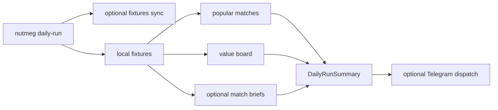

# Daily Operator Schedule

`daily-run` is a safe orchestration command for routine use. It chains existing
services without installing cron or starting a new daemon.

## Flow



## CLI

Safe local dry-run:

```bash
uv run nutmeg daily-run --league epl --days 3 --format json
```

Live sync and brief generation:

```bash
uv run nutmeg daily-run --league epl --days 3 --live-sync --briefs --format json
```

Telegram dispatch is explicit and still respects `--dry-run`:

```bash
uv run nutmeg daily-run --league epl --days 3 --dispatch-telegram --dry-run
uv run nutmeg daily-run --league epl --days 3 --dispatch-telegram --no-dry-run
```

## Safety Defaults

- `--dry-run` is on by default.
- `--live-sync` is off by default.
- `--dispatch-telegram` is off by default.
- Partial results are preserved in the summary instead of hiding skipped work.

