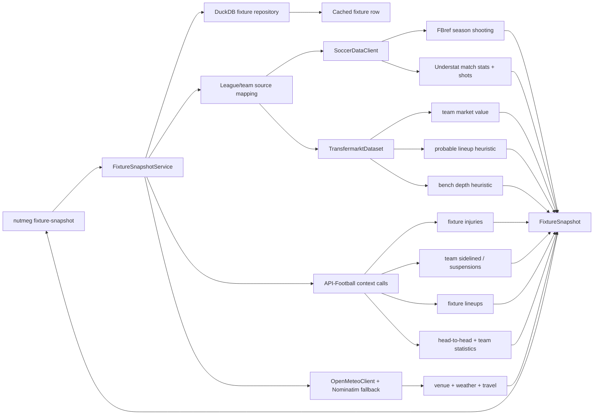

# Fixture Snapshot Architecture

This document describes the fuller Sprint 1 pre-match snapshot path.

## Goal

Given a fixture that already exists in the shared DuckDB cache, Nutmeg should be able to build a richer pre-match snapshot with:

- fixture metadata from the local cache
- FBref season shooting metrics for both teams
- Understat recent-form aggregates for both teams
- Understat shot-summary aggregates for the recent match sample
- Transfermarkt-backed team market-value context
- Transfermarkt-backed probable lineups and bench-depth context
- grouped availability context: injuries, suspensions, returning players, and expected-absence summary
- venue geocoding, kickoff local time, weather, and away-travel context
- API-Football injury, suspension, confirmed-lineup, head-to-head, and split context when configured
- confirmed lineups when available, otherwise probable lineups inferred from Transfermarkt squad data and recent formations
- recent goals/xG and set-piece trend summaries derived from soccerdata recent samples

This now satisfies the Sprint 1 data-puzzle goal more fully while staying explicit about upstream limits.

## Runtime flow

## Source boundaries

- **Base fixture** stays local-first and comes from DuckDB.
- **soccerdata enrichment** is read-only and fetched on demand.
- **Transfermarkt enrichment** provides market value, probable-lineup inference, and bench-depth heuristics.
- **Open-Meteo + Nominatim** provide venue resolution, kickoff local-time support, weather forecasts, and away-travel context.
- **API-Football context calls** provide injuries, suspensions, confirmed lineups, and matchup splits when configured.

### Important upstream note

As verified on 2026-04-24:

- current `transfermarkt-datasets` README exposes clubs, players, valuations, appearances, games, and `game_lineups`
- it does **not** currently expose an injury table

So this implementation uses:

- Transfermarkt for market value and probable-lineup inference
- API-Football for injuries and confirmed lineups

When a local Transfermarkt-style DuckDB dataset is available, probable lineups and
bench-depth context can still lean on lineup history and squad values. On the default
remote path, Nutmeg uses recent formations plus current-squad market-value ordering to
build clearly labeled heuristics.

## Mapping strategy

API-Football, soccerdata, and Transfermarkt do not always use identical identifiers:

- leagues need source-specific soccerdata names in `config/leagues.yaml`
- leagues also carry Transfermarkt competition ids in `config/leagues.yaml`
- teams need source-specific aliases in `config/teams.yaml`

Concrete examples:

- `Tottenham Hotspur` vs Understat's `Tottenham`
- `Arsenal` vs Transfermarkt's `Arsenal Football Club`
- `Gabriel Magalhães` vs `Gabriel` inside the team-scoped player alias catalog

## Failure handling

- unknown fixture id -> fail fast from the repository lookup
- unsupported league -> explicit soccerdata mapping error
- missing source row for one team -> snapshot returns the team block with `None` for the missing section
- missing recent shot events -> shot summary remains `None`
- missing confirmed lineups -> fallback to probable lineups with `status=probable`
- missing API key -> injuries, suspensions, confirmed lineups, head-to-head, and provider splits become unavailable, but cache-backed sections still render
- Open-Meteo stadium miss -> fallback to Nominatim; if both geocoders miss, environment fields stay explicitly unavailable
- referee / rest-days unavailable -> snapshot keeps them as `null` / unavailable instead of fabricating values
- `--format json` keeps machine-readable payloads on stdout; provider noise is redirected away from the JSON stream

## Verification path

- team catalog tests validate alias normalization and source-name resolution
- repository tests validate fixture lookup by `fixture_id`
- weather tests validate venue/weather cache reuse, away-travel calculation, and Nominatim fallback
- snapshot tests validate environment, availability, and matchup/trend assembly
- API adapter tests validate injuries, sidelined availability, splits, referee normalization, and head-to-head summaries
- CLI tests validate richer `fixture-snapshot` text/JSON success and failure paths
