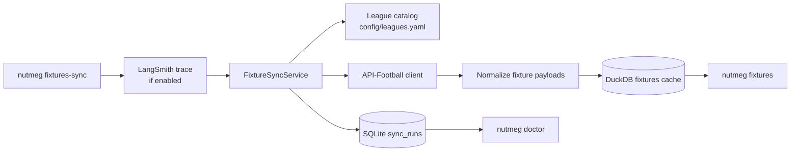

# Fixtures Sync Architecture

This document describes the real Sprint 0 fixture sync path introduced after the initial bootstrap.

## Goal

Provide a true upstream -> cache -> CLI loop for upcoming fixtures while preserving the `Nutmeg-DESIGN-v0.3.md` split between:

- shared objective football data
- isolated mutable/user-scoped state

## Runtime flow

## Storage boundaries

### Shared objective data: DuckDB

The `fixtures` table in DuckDB stores shared facts:
- fixture identity
- competition identity
- kickoff time
- teams
- status
- venue
- score snapshot

No `user_id` is attached here because these are reusable world facts, not user state.

### Mutable operational state: SQLite

The `sync_runs` table in SQLite stores mutable runtime metadata:
- provider
- resource
- scope
- status
- timestamps
- request count
- written row count
- failure details when present

This is operational state, not analytical match data.

## Season resolution

The league catalog carries `season_start_month`. For the current tracked European competitions, the season resolves to:
- current year when month >= 7
- previous year otherwise

So on April 24, 2026, the active season resolves to `2025` for the 2025/26 cycle.

## Failure handling

- Missing API key -> clean CLI failure
- HTTP 429 -> explicit rate-limit error
- `errors` field in a `200` response -> treated as a provider failure
- partial sync failure -> `sync_runs.status = failed`

## Validation path

- unit tests for API parsing and pagination
- repository tests for DuckDB round-trip
- sync service tests for success and failure bookkeeping
- CLI tests for doctor, sync, list, and missing-key behavior

## Historical Fixture Window

`nutmeg fixtures-sync` now accepts `--past-days` (default `0`) in addition to
`--days`. The sync service requests a single API-Football date window from
`now - past_days` through `now + days`, so recent finished fixtures and upcoming
fixtures share the same canonical fixture cache. Finished rows preserve status
and score fields and can be reused by snapshot context such as rest-days.
