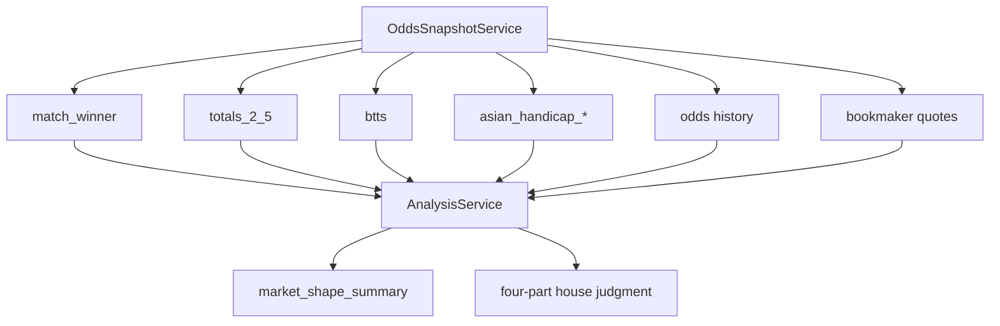

# Market Shape Expansion

This slice extends Nutmeg's analysis workflow beyond a single result-market lean.

## Goal

Use the normalized odds stack to describe both match result direction and likely
match texture.

## What changed

- Added `market_shape_summary` to the analysis evidence contract.
- Reused canonical odds markets `match_winner`, `totals_2_5`, and `btts`.
- Added deterministic interpretation for open-game vs lower-event market shape.
- Added asian-handicap pressure detection for stronger lines, starting at `2.0`,
  so analysis can say when the favorite is priced to win by margin instead of
  merely winning the result market.
- Added explicit caveats when goal-environment coverage is partial.
- Added market-intelligence signals from existing odds history and bookmaker
  quotes: match-winner movement is appended to market evidence, while elevated
  bookmaker disagreement becomes a caveat that caps confidence.

## Why it matters

A result lean alone is too flat. Market shape gives Nutmeg a better way to
explain whether a match is likely to be high-event, low-event, or internally
mixed.

## Evidence flow

## Current boundary

This remains deterministic and CLI-first. It strengthens the evidence contract
before deeper market derivatives or orchestration slices are added.
