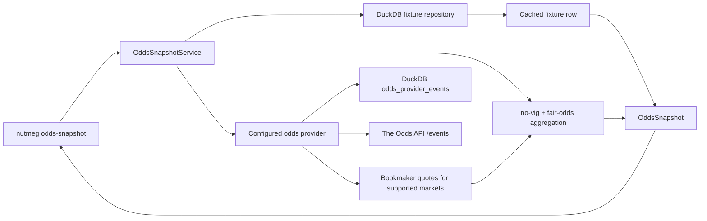

# Odds Snapshot Architecture

This document describes the current Sprint odds path: a fixture-linked pre-match
odds snapshot plus no-vig fair-probability aggregation, with a working
secondary-provider reconciliation path for The Odds API.

## Goal

Given a fixture that already exists in the shared DuckDB cache, Nutmeg should be
able to:

- fetch current pre-match odds for that fixture from the configured provider
- normalize a stable set of canonical markets
- preserve raw bookmaker quotes per outcome
- derive no-vig fair probabilities and fair odds for complete markets
- expose the result through a dedicated CLI workflow in text and JSON forms
- keep a clean provider seam so a second odds source can be added later, but only after fixture-to-event reconciliation exists for providers that are not fixture-id-native

## Runtime flow

## Supported markets in the current slice

- `match_winner`
- `btts`
- `totals_1_5`
- `totals_2_5`
- `totals_3_5`
- `asian_handicap_0_25`
- `asian_handicap_0_5`
- `asian_handicap_0_75`
- `asian_handicap_1_0`
- `asian_handicap_1_25`
- `asian_handicap_1_5`
- `asian_handicap_1_75`
- `asian_handicap_2_0`
- `asian_handicap_2_25`
- `asian_handicap_2_5`

The odds contract has now moved beyond the first minimal slice. Totals families
and a broader asian handicap family are normalized into the same canonical
market model so downstream CLI, history storage, and fair-probability logic do
not need provider-specific parsing branches. API-Football selection labels such
as `Home -2` and The Odds API spread points such as `-0.25` are collapsed into
the same absolute-line market keys while preserving home/away outcome ordering.

## Source boundaries

- **Fixture identity** stays local-first and comes from DuckDB.
- **Odds provider fetch** is live and supports API-Football plus a reconciled
  The Odds API path for mapped leagues.
- **Fair probability** is local math derived from bookmaker quotes, not a
  predictive model.
- **CLI contract** stays provider-agnostic: fixture + provider metadata +
  canonical markets + raw/derived separation.
- **Provider health** is currently adapter-local: The Odds API exposes an
  in-process health snapshot for cache hits/misses, reconciliation attempts,
  stale refreshes, last event id, and last error without changing the canonical
  odds snapshot schema.

## Failure handling

- unknown fixture id -> fail fast from the local fixture repository lookup
- provider key missing -> CLI exits cleanly with provider error text
- no odds returned for a valid fixture -> snapshot stays explicit with unavailable markets
- incomplete market -> raw prices remain visible, fair probability stays unavailable
- duplicate bookmaker rows -> adapter deduplicates them before aggregation
- unsupported market family -> ignored for now instead of leaking unstable structure into the contract

## Provider and history seams

The current boundary is:

- provider adapter returns a normalized provider feed of canonical market quotes
- service derives fair probabilities and builds the consumer snapshot
- history repository persists fair-probability snapshots by fixture + market + timestamp
- CLI renders current markets plus movement/drift summaries without provider-specific parsing logic

Nutmeg now also carries a provider selector seam so a second provider can be
attached behind the same snapshot interface. However, not every provider fits the
current `fixture_id -> odds snapshot` contract equally well.

`the-odds-api` is event-key and sport-key oriented rather than fixture-id-native,
so Nutmeg now resolves the local fixture into a provider event before requesting
odds. The reconciliation path is:

1. load the cached Nutmeg fixture
2. map the league into a configured The Odds API sport key
3. check `odds_provider_events` for an existing fixture-to-event link
4. if no cached link exists, query `/sports/{sport}/events` and match on
   kickoff time plus normalized home/away team names
5. persist the resolved event id and reuse it for later odds fetches
6. request event odds and normalize them into the canonical market contract
7. if a cached event odds request returns a stale/not-found response, delete
   that fixture/provider mapping, reconcile once, upsert the replacement event,
   and retry the odds request without exposing cache internals to the snapshot

That means the current complete path is:

- API-Football for fixture-id-native live odds snapshots
- The Odds API for mapped leagues with reconciliation-backed event lookup
- provider selector seam preserved for future expansion to other event-key
  providers

## Residual risks

- DuckDB still serializes file access across separate CLI processes, so parallel local commands can contend on `analytics.duckdb`; this is a workspace/runtime limitation to track, not a blocker for the single-user Phase 1 flow.
- Duplicate bookmaker rows are deduplicated by bookmaker + canonical selection and keep the first seen quote; if a provider starts sending multiple distinct prices for the same selection in one payload, that policy should be revisited with a timestamp-aware rule.
- The Odds API reconciliation currently depends on kickoff time plus normalized
  team names. That is truthful and cached, and cached stale/not-found event ids
  now trigger one automatic invalidation + re-reconciliation attempt, but edge
  league naming variants can still make replacement reconciliation fail
  truthfully.
