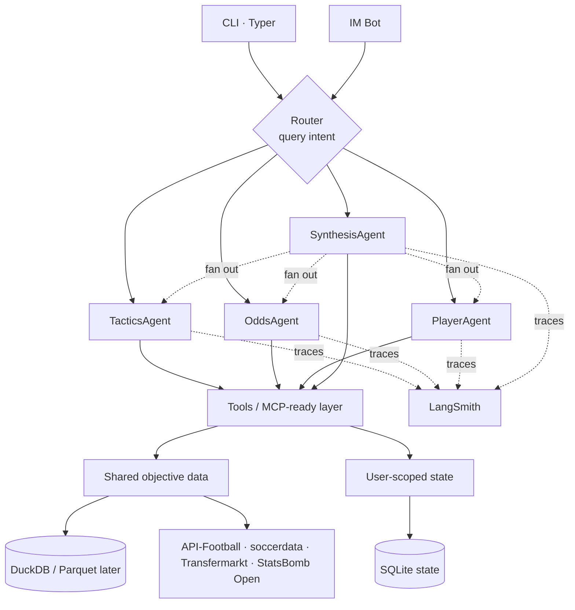
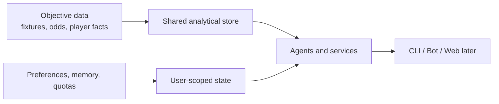
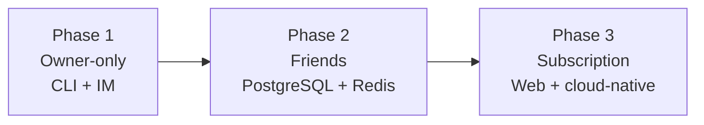

# Nutmeg Architecture Overview

This document distills the implementation-facing architecture from `Nutmeg-DESIGN-v0.3.md`.

## Product Shape

Nutmeg is a football analysis agent built around four analytical responsibilities:
- Tactics analysis
- Odds and market analysis
- Player intelligence
- Cross-module synthesis

Phase 1 is intentionally a private operator tool. That keeps the runtime simple while forcing the codebase to carry `user_id` and migration seams for user-state concerns from day one.

## Runtime Topology

## Module Boundaries

- `nutmeg.config`: runtime settings and file-backed configuration
- `nutmeg.core`: identity, quota, and repository contracts
- `nutmeg.domain`: normalized business entities like fixtures and sync summaries
- `nutmeg.storage`: shared cache and mutable state persistence
- `nutmeg.services`: application services used by interfaces
- `nutmeg.process`: workflow and long-running harness inspection helpers
- `nutmeg.agents`: prompt definitions and router logic for future LangGraph orchestration
- `nutmeg.data`: external provider adapters
- `nutmeg.models`: reusable analytical utilities and model placeholders
- `nutmeg.interfaces`: CLI and future bot surfaces

## Data Boundaries

- Shared facts are globally reusable.
- Mutable state that reflects operator behavior or user preferences always carries `user_id`.
- Sync-run metadata is mutable operational state and therefore does not live in the shared analytical cache.

## Live paths

- Sprint 0 shared fixture sync: `docs/architecture/fixtures-sync.md`
- Shared reference/materialization layer: `docs/architecture/reference-data.md`
- Sprint 1 fuller pre-match snapshot: `docs/architecture/fixture-snapshot.md`

## Phase Evolution

## Delivery Workflow

1. Update the design doc when product intent changes.
2. Update the matching Spec Kit feature package.
3. Run planning and task coverage gates.
4. Implement via TDD.
5. Verify with fresh evidence before claiming completion.
6. When module boundaries, call paths, or architectural docs change, run `make graph` and review `graphify-out/GRAPH_REPORT.md` before the next architecture/debugging pass.
