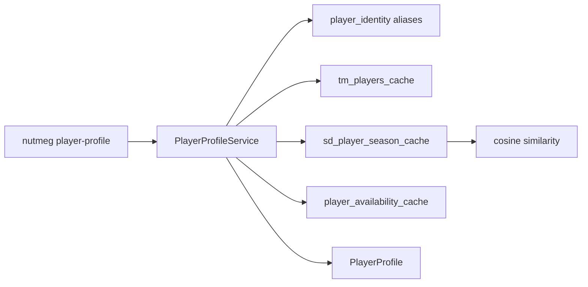

# Player Profile v0

`player-profile` turns the existing player identity and materialization work into
a first-class operator surface.

## Flow



## Contract

The profile includes:

- identity resolution: canonical name, team, identity id, confidence
- Transfermarkt cache: provider player id, position, current market value
- soccerdata-style season metrics: minutes and per-90 attacking/duel metrics
- availability: current status, reason, expected return, source
- similar players: deterministic cosine similarity over available per-90 metrics
- unavailable sections: explicit section names when cache data is missing

The service is local-first. It does not call live providers during profile reads.
Live data should first be materialized into the DuckDB cache.

## CLI

```bash
uv run nutmeg player-profile --league epl --season 2025 --team Arsenal --player "Bukayo Saka" --format json
```

## Limitations

- `sd_player_season_cache` and `player_availability_cache` are cache contracts;
  upstream materializers can fill them incrementally.
- Similarity only uses the metrics that exist locally. It is useful for first
  pass comparison, not a full scouting model.

