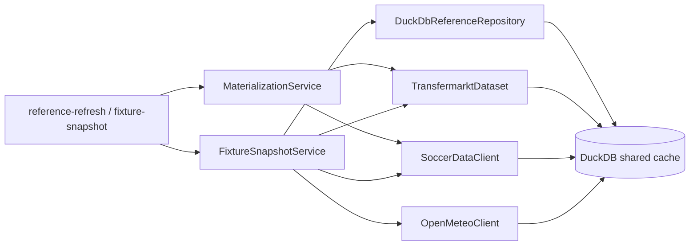

# Shared Reference Data Architecture

This document describes the shared reference-data layer added for richer Sprint 1
pre-match snapshots.

## Goal

Nutmeg needs a shared DuckDB-backed layer that can:

- reconcile provider player names into canonical team-scoped identities
- materialize the provider-heavy inputs used by `fixture-snapshot`
- cache venue geocoding and weather forecasts for environment context
- support fallback stadium geocoding when Open-Meteo's search index does not resolve venue names

This keeps snapshot reads more accurate across providers and less dependent on
slow remote fetches.

## Core pieces

- **Player identity map**: canonical player records keyed by `league + team + canonical player`
- **Player alias rows**: provider-specific aliases and optional provider ids
- **Transfermarkt cache tables**: local club/player/game tables for market value and probable lineups
- **soccerdata cache tables**: local season metrics, recent match rows, and shot summaries
- **Venue reference cache**: canonical venue geocode and timezone rows
- **Weather cache**: fixture-window forecast rows from Open-Meteo
- **Fallback geocoding**: Nominatim lookup for stadium names that Open-Meteo cannot resolve directly

## Runtime flow

## Matching rules

Player identity resolution stays conservative:

1. provider-id match when available
2. same-team alias match from `config/player_aliases.yaml`
3. same-team normalized canonical-name match
4. otherwise unresolved

Nutmeg does **not** fabricate a confident player match when the evidence is weak.

## Local-first read path

- `TransfermarktDataset` reads `tm_*_cache` tables when present
- `SoccerDataClient` reads `sd_*_cache` tables when present
- `OpenMeteoClient` reuses persisted venue and weather rows when present and can fall back to Nominatim for stadium geocoding

If the required cache is missing, the system can still fall back to live reads.

## Current limits

- player identity is still team-scoped and alias-driven; there is no global footballer entity graph yet
- kickoff local time, travel, and rest-days now work when venue/weather references and historical fixture rows are available
- API-Football-backed richer context still depends on `NUTMEG_API_FOOTBALL_KEY`; without it, the snapshot degrades to cache-backed sections only
