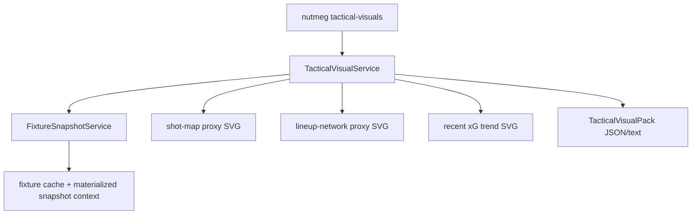

# Tactical Visuals v0

`tactical-visuals` turns an existing fixture snapshot into deterministic SVG
artifacts that can be inspected locally or attached later by bot/Web surfaces.
The v0 scope is intentionally local-first: it does not call live providers and
does not claim event-data parity with mplsoccer, StatsBomb, xT, or VAEP.

## Flow



## Artifacts

- `shot-map`: aggregate shot-count and xG density markers. This is a proxy, not
  real event coordinates.
- `lineup-network`: starter/probable-lineup structure with nominal connections.
  This is a proxy, not pass-event volume.
- `xg-trend`: recent xG/xGA bar visual from matchup trend context.

Missing inputs are reported in `unavailable_sections` instead of being
fabricated. That keeps operator output safe when a fixture lacks lineups, shot
summary, or recent xG trend data.

## CLI Usage

```bash
uv run nutmeg tactical-visuals --fixture-id epl-001 --format json
uv run nutmeg tactical-visuals --fixture-id epl-001 --output-dir .nutmeg-data/visuals
```

When `--output-dir` is provided, SVG files are written with stable fixture-based
filenames and each artifact includes its relative path in the JSON/text output.

## Limits and Future Path

This slice closes the product gap for readable local tactical attachments. The
next research-grade step is a separate event-data provider layer that can render
true shot maps, pass networks, xT, VAEP, and player radar/pizza visuals from
StatsBomb Open or another licensed event source.
