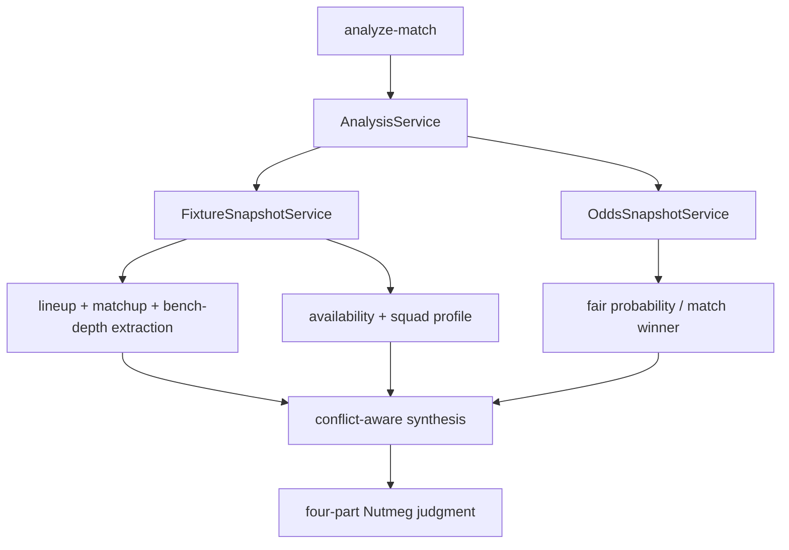

# Tactics Synthesis v0

This slice deepens Nutmeg's first analysis workflow without jumping straight into
LangGraph orchestration.

## Why it exists

`008-analysis-judgment-v0` proved the first deterministic judgment path. This
slice upgrades that path so the output reads more like football analysis and
less like a market-only formatter.

## What changed

- Added a distinct `tactical_summary` evidence bucket.
- Added `conflict_state` so downstream consumers can tell whether football
  context and market context agree.
- Lowered confidence automatically when tactical/context evidence and market
  evidence disagree.
- Kept the four-part house judgment contract stable.

## Evidence flow

## Current boundary

This is still deterministic and local. The purpose is to stabilize the evidence
contract before a later Router + SynthesisAgent / LangGraph phase.
