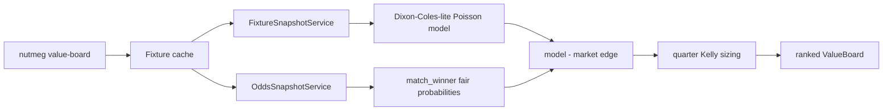

# Value Board v0

The value board closes the first Sprint 3 product gap from
`Nutmeg-DESIGN-v0.3.md`: odds snapshots are no longer only market summaries.
Nutmeg now creates an independent baseline probability and compares it with the
market fair probability.

## Flow



## Model Scope

The current model is intentionally labeled `dixon-coles-lite-poisson`.
It uses recent xG matchup context when available:

- home expected goals = average of home recent xG for and away recent xG against
- away expected goals = average of away recent xG for and home recent xG against
- fallback = season xG per match with a small home/away adjustment

The low-score Dixon-Coles-style correction is deterministic and useful for a
baseline board, but it is not yet a trained league-specific Dixon-Coles model.
That stronger calibration should be a later model-training spec.

## Candidate Contract

Each `ValueCandidate` includes:

- fixture identity and kickoff
- outcome key/name (`home`, `draw`, `away`)
- model probability
- market fair probability
- edge (`model_probability - market_probability`)
- best available decimal odds
- expected value from best odds
- quarter-Kelly fraction
- rating (`strong`, `watchlist`, `thin`)
- source notes for model and odds provider

Fixtures with missing snapshots, insufficient xG context, or unavailable
`match_winner` markets are recorded in `skipped` instead of failing the whole
league board.

## CLI

```bash
uv run nutmeg value-board --league epl --days 3 --limit 10 --format json
uv run nutmeg value-board --league epl --days 3 --min-edge 0.05
```

The command uses existing local fixture cache and existing snapshot/odds provider
configuration. It does not create a new storage table.

## Limitations

- Only match-winner outcomes are ranked in v0.
- The board can be slow if many live provider calls are needed; keep `--days`
  and `--limit` bounded during live operation.
- Positive edge is a diagnostic signal, not a betting instruction. Nutmeg keeps
  the final decision with the operator.

