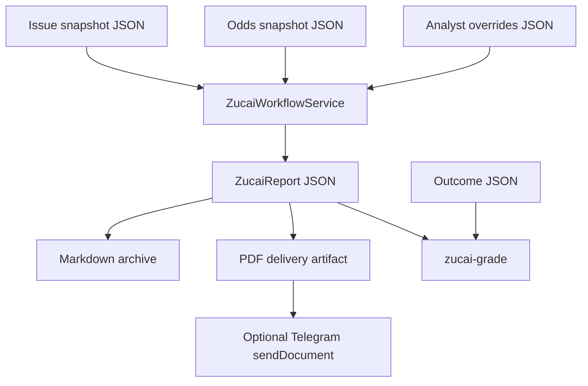

# Traditional Zucai 14-Match Workflow

`zucai-report` turns a recurring Chinese Sports Lottery traditional 14-match issue into a reusable Nutmeg workflow. It is intentionally issue-level: it constructs `3/1/0` pool recommendations and plans, not a single-fixture betting tip.

## Data Flow



## Commands

Generate the bundled no-network sample for issue 26068:

```bash
uv run nutmeg zucai-report --issue-id 26068 --pdf --format json
```

Generate from explicit snapshots:

```bash
uv run nutmeg zucai-report \
  --issue-file nutmeg/zucai/samples/26068-issue.json \
  --odds-file nutmeg/zucai/samples/26068-odds.json \
  --overrides-file nutmeg/zucai/samples/26068-overrides.json \
  --output-dir .nutmeg-data/zucai \
  --pdf
```

Dry-run Telegram delivery:

```bash
uv run nutmeg zucai-report --issue-id 26068 --pdf --dispatch-telegram --dry-run --format json
```

Grade settled outcomes:

```bash
uv run nutmeg zucai-grade \
  --report-file .nutmeg-data/zucai/zucai-26068-report.json \
  --outcomes-file nutmeg/zucai/samples/26068-outcomes.json \
  --format json
```

## Snapshot Contracts

- Issue snapshots contain issue metadata, sources, and exactly 14 matches numbered 1 through 14.
- Odds snapshots contain latest average decimal odds for `home/draw/away`, mapped to `3/1/0` in the report.
- Overrides can replace per-match picks, risk tiers, confidence, rationale, and optional plan strings.
- Outcome snapshots contain final `3/1/0` results for grading.

The JSON schemas live under `.specify/specs/041-zucai-14match-workflow-v0/contracts/`.

## Recommendation Semantics

The service produces a deterministic baseline from odds and match risk flags, then applies validated analyst overrides. This keeps every issue reproducible while allowing late team-news judgement to be explicit and reviewable.

Every recommendation includes:

- `pick`: normalized unique `3/1/0` string.
- `primary`: strongest single code.
- `confidence`: 0..1 score for ranking and 任九 selection.
- `risk_tier`: `banker`, `lean`, `cover`, or `volatile`.
- `rationale`: human-readable reasoning.
- `override_applied`: whether analyst input replaced the baseline.

## Responsible-Use Boundary

This workflow is betting-analysis assistance only. It does not place bets, connect sportsbooks, guarantee profit, or imply certainty. PDF and Telegram captions include this boundary, and real Telegram dispatch is off unless the operator explicitly requests `--dispatch-telegram --no-dry-run`.

## Future Extensions

- Trusted source parsers that convert official schedule pages and odds pages into the v0 JSON snapshots.
- Database-backed issue archive and calibration history.
- Pool-level optimization and budget-aware plan generation beyond simple deterministic复式/任九 plans.
- Web/PWA issue workspace for subscription-era users.
