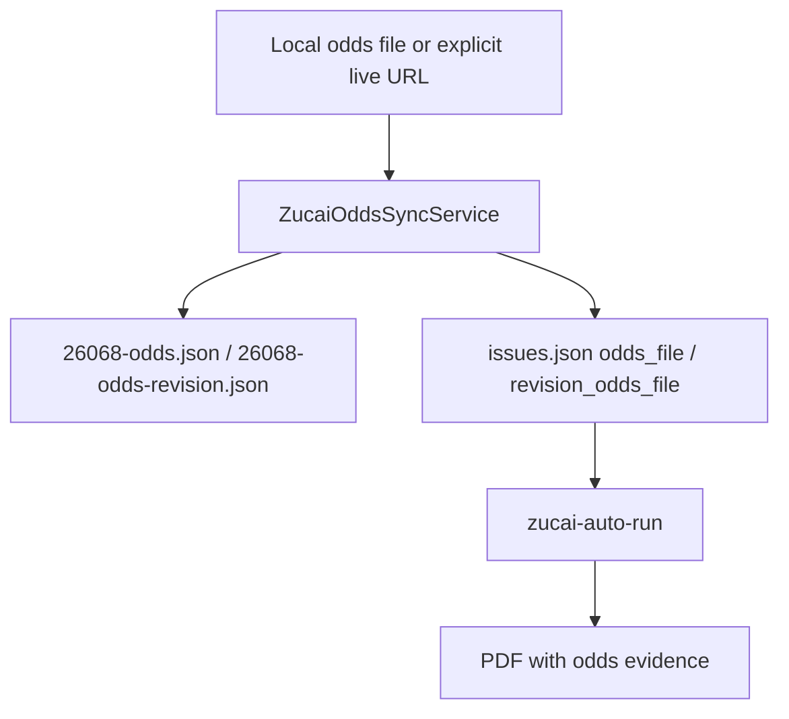

# Zucai Odds Source

`zucai-odds-sync` parses a cached or explicitly fetched odds table into the existing `*-odds.json` contract used by `zucai-report` and `zucai-auto-run`.

## Data Flow



## Commands

Afternoon odds:

```bash
uv run nutmeg zucai-odds-sync \
  --source-file nutmeg/zucai/samples/26068-odds-source-afternoon.html \
  --issue-id 26068 \
  --slot afternoon \
  --captured-at "2026-04-26 16:00 CST" \
  --output-dir .nutmeg-data/zucai/odds-smoke \
  --registry-file .nutmeg-data/zucai/odds-smoke/issues.json \
  --format json
```

Revision odds:

```bash
uv run nutmeg zucai-odds-sync \
  --source-file nutmeg/zucai/samples/26068-odds-source-revision.html \
  --issue-id 26068 \
  --slot revision \
  --captured-at "2026-04-26 18:30 CST" \
  --output-dir .nutmeg-data/zucai/odds-smoke \
  --registry-file .nutmeg-data/zucai/odds-smoke/issues.json \
  --format json
```

## Slot Registry Fields

- `afternoon` updates `odds_file`.
- `revision` updates `revision_odds_file`.

Existing registry fields such as `issue_file`, `overrides_file`, and `revision_overrides_file` are preserved.

## Scope Boundary

The odds snapshot is evidence for analysis only. This feature does not log into bookmakers, place bets, connect sportsbooks, or promise profit. URL fetch remains opt-in through `--live-fetch`.
