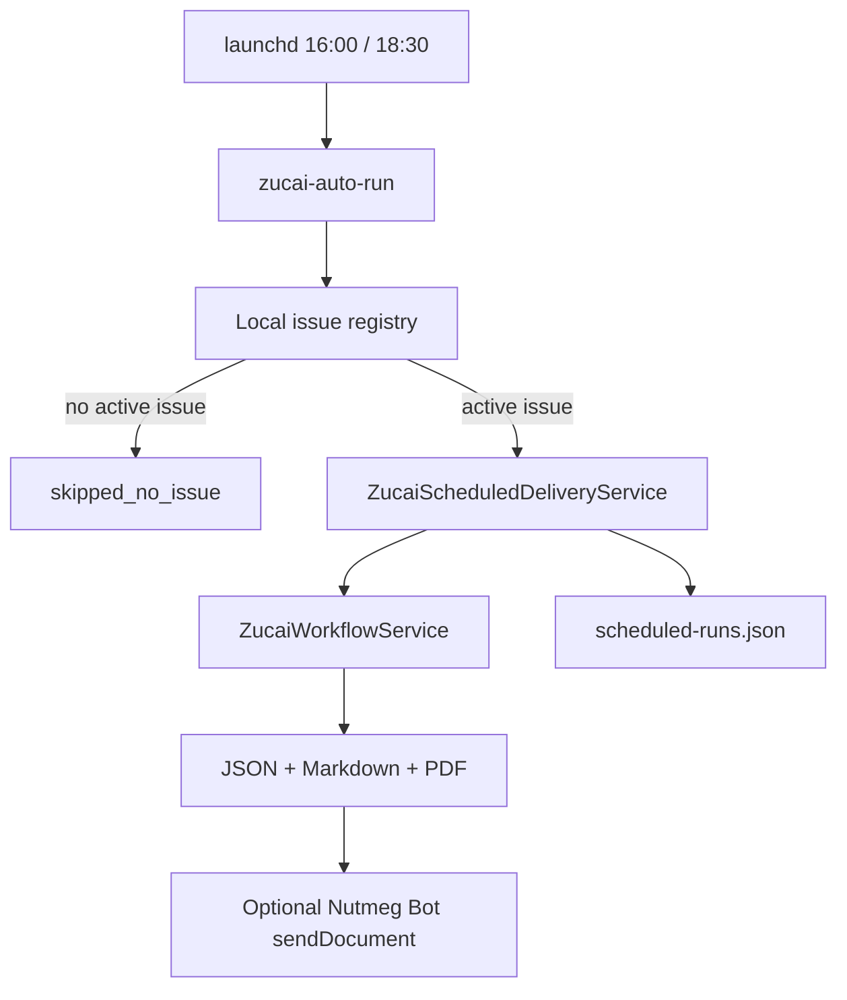

# Zucai Scheduled Delivery

`zucai-auto-run` is the daily automation wrapper for traditional足彩胜负彩14场/任选9场. It checks a local issue registry for the requested date and slot, stays silent when no issue exists, and reuses `ZucaiWorkflowService` to generate the report when an active issue is present.

## Data Flow



## Commands

Dry-run the bundled sample first report:

```bash
uv run nutmeg zucai-auto-run \
  --date 2026-04-26 \
  --slot afternoon \
  --registry-file nutmeg/zucai/samples/scheduled-issues.json \
  --dispatch-telegram \
  --dry-run \
  --format json
```

Dry-run the 18:30 revision report:

```bash
uv run nutmeg zucai-auto-run \
  --date 2026-04-26 \
  --slot revision \
  --registry-file nutmeg/zucai/samples/scheduled-issues.json \
  --dispatch-telegram \
  --dry-run \
  --format json
```

No-issue smoke:

```bash
uv run nutmeg zucai-auto-run \
  --date 2026-04-27 \
  --slot afternoon \
  --registry-file nutmeg/zucai/samples/scheduled-issues.json \
  --format json
```

Expected status: `skipped_no_issue` and no Telegram dispatch.

## Registry

Default registry path for real operation:

```text
.nutmeg-data/zucai/issues.json
```

Example:

```json
{
  "entries": [
    {
      "issue_id": "26068",
      "enabled": true,
      "active_dates": ["2026-04-26"],
      "issue_file": "26068-issue.json",
      "odds_file": "26068-odds.json",
      "overrides_file": "26068-overrides.json",
      "revision_odds_file": "26068-odds-1830.json",
      "revision_overrides_file": "26068-overrides-1830.json"
    }
  ]
}
```

Relative paths resolve relative to the registry file directory first, then relative to the current working directory.

## Slots

- `afternoon`: 16:00 first analysis report, caption label `16:00首版分析`.
- `revision`: 18:30 decision-confirmation report, caption label `18:30修正确认`.

Each slot writes artifacts under:

```text
.nutmeg-data/zucai/scheduled/<issue_id>/<run-date>-<slot>/
```

Run records live at:

```text
.nutmeg-data/zucai/scheduled-runs.json
```

Duplicate `run_date + slot + issue_id` runs skip unless `--force` is provided.

## launchd Templates

Templates are provided but not installed automatically:

```text
scripts/launchd/com.nutmeg.zucai.afternoon.plist
scripts/launchd/com.nutmeg.zucai.revision.plist
```

After reviewing paths and Telegram settings, copy them to `~/Library/LaunchAgents/` and load them with `launchctl`.

## Safety Boundary

The scheduler never places bets and never connects to sportsbooks. Real Telegram delivery requires the command to include `--dispatch-telegram --no-dry-run`, and the Telegram client still sends only to configured Nutmeg chat ids. On no-issue days, Nutmeg returns a skipped result and does not send a bot message.
