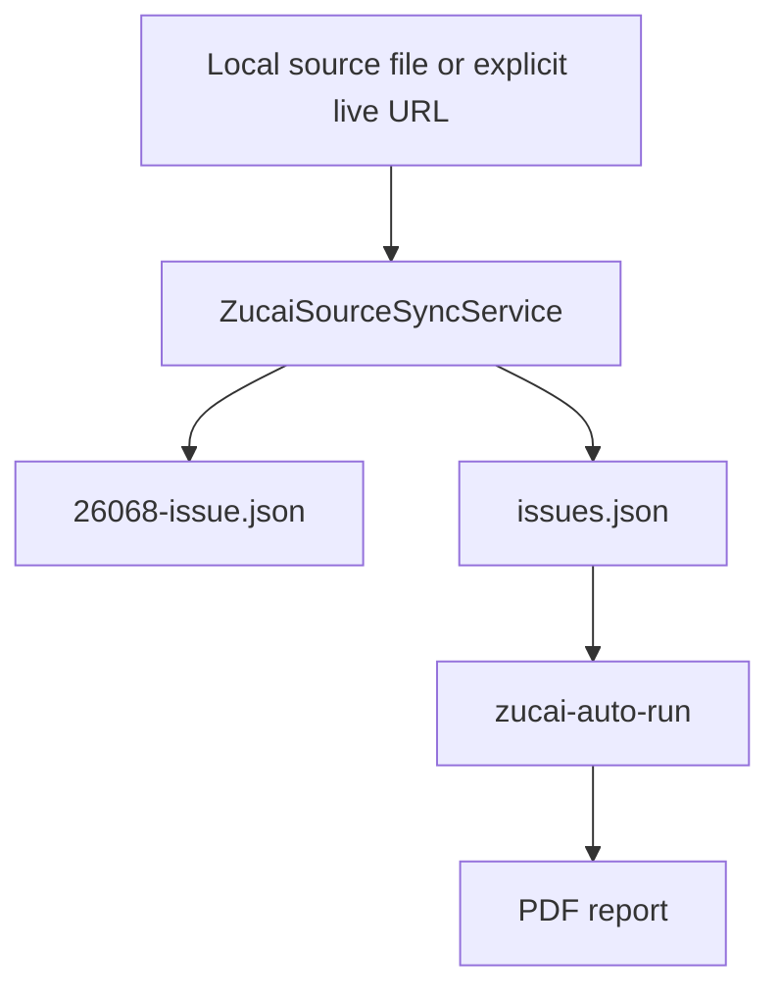

# Zucai Source Parser

`zucai-source-sync` fills the data gap between scheduled delivery and manual registry maintenance. It parses official-like traditional足彩 schedule notices into 14-match issue snapshots and updates the registry consumed by `zucai-auto-run`.

## Data Flow



## Command

Local deterministic sync:

```bash
uv run nutmeg zucai-source-sync \
  --source-file nutmeg/zucai/samples/26068-source-notice.html \
  --date 2026-04-26 \
  --output-dir .nutmeg-data/zucai/source-smoke \
  --registry-file .nutmeg-data/zucai/source-smoke/issues.json \
  --format json
```

Use generated registry with scheduled delivery:

```bash
uv run nutmeg zucai-auto-run \
  --date 2026-04-26 \
  --slot afternoon \
  --registry-file .nutmeg-data/zucai/source-smoke/issues.json \
  --output-dir .nutmeg-data/zucai/source-smoke/scheduled \
  --run-record-file .nutmeg-data/zucai/source-smoke/scheduled-runs.json \
  --dispatch-telegram \
  --dry-run \
  --format json
```

## Parsing Strategy

The parser converts HTML to normalized text lines and looks for sections like:

```text
足球彩票胜负游戏（14场和任选9场）第26068期
```

It then extracts rows with match number, home team, away team, match date, and carried-forward competition names. Sections that do not produce exactly 14 matches are skipped with warnings.

## Registry Merge

Generated registry entries include:

- `issue_id`
- `enabled`
- `active_dates`
- `issue_file`
- generated `notes`

If the existing registry already has `odds_file`, `overrides_file`, `revision_odds_file`, or `revision_overrides_file` for the same issue, those operator-maintained fields are preserved.

## Live Fetch Boundary

`--source-url` is rejected unless `--live-fetch` is present. This keeps normal use and tests local-first. Live URL fetch uses bounded timeout and max-byte settings, and should only be used with trusted sources.

## Scope Boundary

This feature discovers issues and writes schedule snapshots only. It does not parse odds, place bets, connect sportsbooks, or claim guaranteed outcomes.
