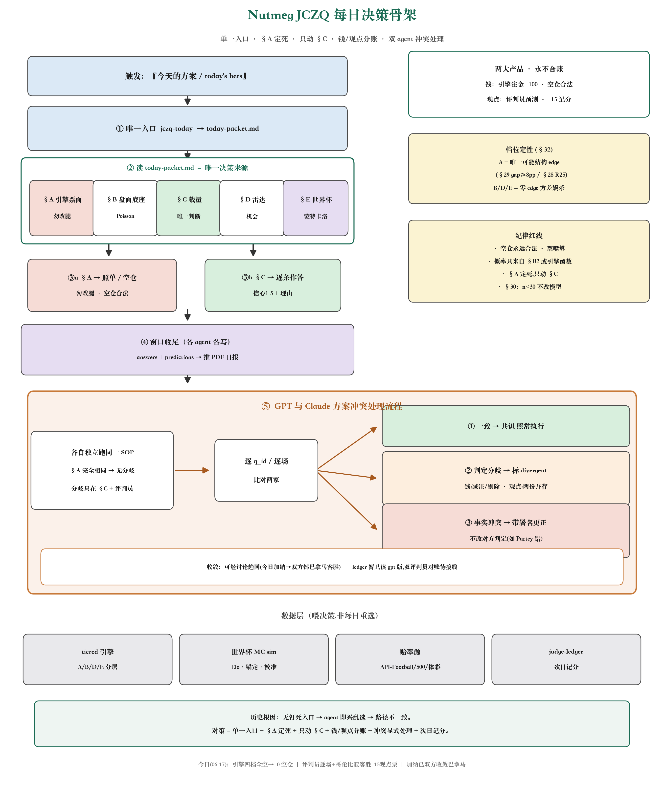

# JCZQ 每日决策骨架（结构图）

> 本文是 Nutmeg JCZQ 每日决策流程的**一页式结构图 + 说明**。
> 关联：`CLAUDE.md` / `AGENTS.md` 的「JCZQ Daily Decision SOP」(行为指令)、
> `docs/jczq-decision-chain-critique.md`(决策链结构性复盘 / 根因)、spec §32(单一入口)。
> 图片快照截至 **2026-06-17**;重渲染见文末。

## 五个分区怎么读

1. **唯一入口** — 触发短语(「今天的方案 / today's bets」)→ 只跑 `uv run nutmeg jczq-today`
   → 写 `today-packet.md`(断网用 `--replay` 回放快照)。**别的命令一律不跑。**
2. **决策包五节** — `today-packet.md` 是今日**唯一决策来源**：
   §A 引擎票面(tiered A/B/D/E,**勿改腿**)· §B 盘面底座(热度+Poisson+EV)·
   §C 裁量问题(**唯一动判断处**)· §D 机会雷达 · §E 世界杯蒙特卡洛预测。
3. **两条执行线** — ③a §A 照单执行或整张空仓(勿改腿、勿即兴重选,空仓永远合法)；
   ③b §C 逐条作答(q_id / 决定 / 信心 1-5 / 一行理由)。**§C 之外全被引擎定死。**
4. **窗口收尾**(世界杯窗口内必做) — 每个 agent 各写 `judgment-answers.json` +
   `predictions.json` → `jczq-report --dispatch-telegram` 推 PDF 日报。
5. **GPT 与 Claude 方案冲突处理** — 见下。

## 冲突处理流程（图中橙色带）

两 agent **各自独立**跑同一 SOP；因 §A 引擎票面完全相同 → **分歧只可能出现在
§C 作答 + 评判员逐场观点**。逐 q_id / 逐场比对后三分支处置：

| 分支 | 触发 | 处置 |
| --- | --- | --- |
| ① 一致 | 两家答案相同 | 共识，照常执行 |
| ② 判定分歧 | 胜负/比分判定不同 | 标 `divergent: true`；**钱=减注/剔除(偏空仓)**；**观点=两份并存记分**(`predictions.json` + `predictions-claude.json`) |
| ③ 事实冲突 | 一方事实写错 | `fact_correction` **带 provenance 更正**，不改对方判定(除非事实翻盘) |

可经讨论**收敛**(例：2026-06-17 加纳 vs 巴拿马，GPT 与 Claude 最终都判巴拿马客胜)。
⚠️ 当前 `judge-ledger` 只读 `predictions.json`(gpt 版)，**双评判员对账尚待接线**。

## 两大产品 · 永不合账

- **钱(注金纪律)**：引擎 A/B/D/E · ¥100 娱乐预算 · **空仓永远合法**。
- **观点(记分牌)**：评判员预测 · ¥15 单关 · 大胆是零成本(问责靠记分牌,不靠钱包)。

## 纪律红线

- 空仓永远合法，不为有票凑票；
- **禁嘴算**：概率 / edge 只来自决策包 §B2 或直接调引擎函数；
- §A 定死，只动 §C；
- §30 校准纪律：桶 n<30 不改模型、单日不重定标。

## 档位定性（spec §32）

- **A 稳健底仓** = 唯一可能有结构 edge 的桶(§29 体彩−欧赔 gap ≥8pp / §28 R25 联赛偏差)；
- **B/D/E** = 明确零 edge、纯方差娱乐(−13% 抽水)。

## 数据层（喂决策，非每日重选）

`tiered 引擎`(jczq_tiered) · `世界杯 MC sim`(atk/dfn Elo + 市场锚定 + 伤病信号 + 校准日志) ·
`赔率源`(API-Football 主 / 500.com 备 / 体彩 sporttery) · `judge-ledger`(次日记分)。

## 历史根因与对策

无钉死入口 → 每个 agent 即兴在多套命令/引擎间挑选 → 同一任务决策路径不一致。
**对策 = 单一入口 + §A 定死 + 只动 §C + 钱/观点分账 + 冲突显式处理 + 次日记分问责。**

---

**重渲染**：`uv run python scripts/render_decision_skeleton.py`
(依赖 matplotlib + 系统 CJK 字体；输出覆盖本目录 `jczq-decision-skeleton.png`)。
