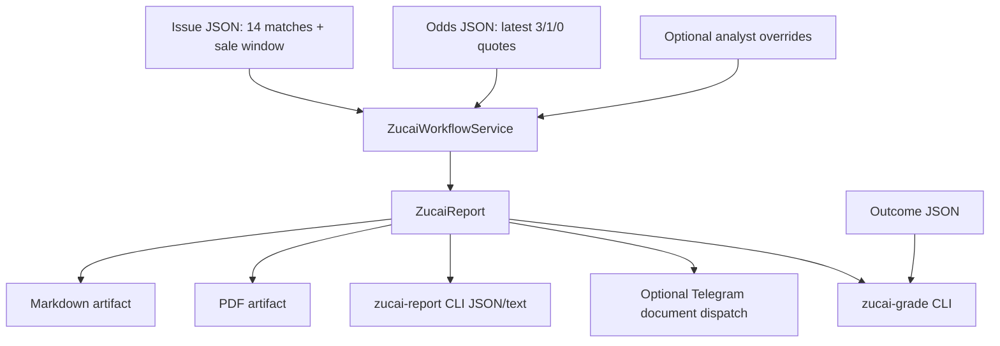

# Traditional Zucai 14-Match Workflow Design

Date: 2026-04-26
Feature: `041-zucai-14match-workflow-v0`

## Design Approval Context

The user confirmed that traditional Chinese Sports Lottery 14-match pools are a recurring, every-issue workflow. The prior approved direction is to make the ad hoc 26068 analysis reusable inside Nutmeg: issue schedule recognition, odds/data input, risk-tiered 14-match recommendations, PDF/Telegram delivery, and review support.

## Product Intent

Nutmeg should treat traditional `胜负彩14场/任选9场` as a first-class operator workflow, separate from single-fixture Nutmeg match briefs. Each issue should be reproducible from explicit source snapshots and analyst overrides, so recommendations can be regenerated, sent, archived, and later graded.

## v0 Scope

- Load a 14-match issue from an explicit structured JSON file or bundled sample issue.
- Load latest odds/provider averages from an explicit structured JSON file.
- Apply deterministic risk rules plus optional analyst overrides.
- Produce a report payload with recommendations, confidence/risk tiers, generated复式/任九 plans, warnings, and source ledger.
- Render Markdown and PDF artifacts under an output directory.
- Support safe Telegram document dispatch with dry-run default and explicit `--no-dry-run`.
- Grade a completed issue from a result/outcome file for replay and calibration.

## Non-Goals

- No automatic bet placement, sportsbook connection, or guaranteed-profit language.
- No arbitrary web scraping in v0. Web pages can be converted into structured snapshots by a future explicit source-parser spec.
- No paid subscription billing or public SaaS workflow in this slice.
- No attempt to replace Nutmeg's single-match model; this is a pool-construction workflow.

## Architecture

## Key Design Decisions

1. **Structured source snapshots first**: v0 accepts JSON snapshots for schedule and odds. This keeps tests deterministic and avoids fragile hard-coded scraping. Later specs can add trusted HTML/API parsers that emit the same JSON.
2. **Deterministic core plus override seam**: Nutmeg generates a baseline pick from odds/risk flags, but the operator can provide per-match overrides and plan overrides. This matches real足彩 work, where late team news and human risk management matter.
3. **PDF is an artifact, not the source of truth**: JSON report payload and Markdown are the auditable source; PDF is a delivery rendering.
4. **Dry-run dispatch by default**: Telegram delivery mirrors `daily-run`: no outbound message unless explicitly requested, and real send requires `--no-dry-run`.
5. **Review from outcomes**: Result grading is file-driven in v0 so every issue can be replayed even if no database schema is introduced.

## Error Handling

- Issue files must contain exactly 14 unique match numbers; otherwise the report fails clearly.
- Missing odds do not fabricate confidence; affected matches carry warnings and use a low-confidence baseline.
- Invalid override picks are ignored with warnings rather than corrupting the issue.
- PDF generation failures keep the JSON/Markdown report available and return the PDF error in warnings.
- Telegram dispatch failure returns a failed dispatch object without hiding the generated artifact paths.

## Testing Strategy

- Unit tests for issue/odds/override normalization and validation.
- Service tests for recommendation generation, plan counts, Markdown/PDF rendering, and outcome grading.
- CLI tests for `zucai-report`, `zucai-grade`, dry-run dispatch behavior, and JSON contracts.
- Router/docs tests or smoke checks for safe OpenClaw usage if the router is extended in this slice.
- Full repo verification with ruff, compileall, and `scripts/verify.sh` before marking the spec complete.
