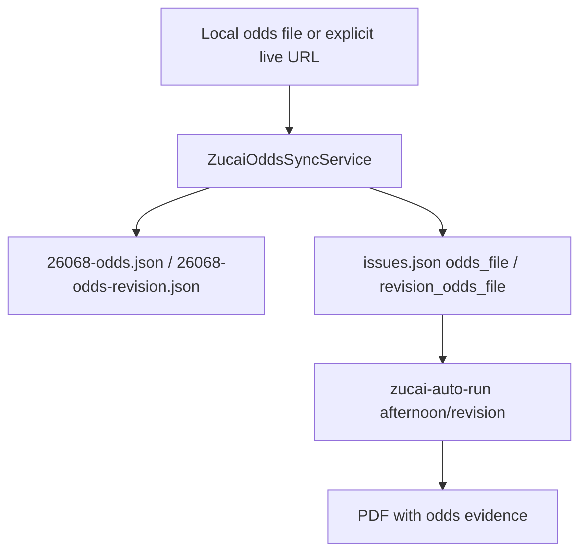

# Zucai Odds Source Design

Feature: `044-zucai-odds-source-v0`  
Date: 2026-04-26

## Intent

`043` generates the issue registry and 14-match schedule snapshots. `044` adds the odds input layer: parse local/trusted odds tables into the existing `*-odds.json` contract and update the registry fields used by `zucai-auto-run`.

## Data Flow

## Slot Semantics

- `afternoon` writes `odds_file`.
- `revision` writes `revision_odds_file`.

The parser preserves issue and override paths already maintained by `043` or the operator.

## Boundaries

- Average home/draw/away odds only in v0.
- No sportsbook connection, no bet placement, no guaranteed-profit language.
- No URL fetch unless `--live-fetch` is explicit.
