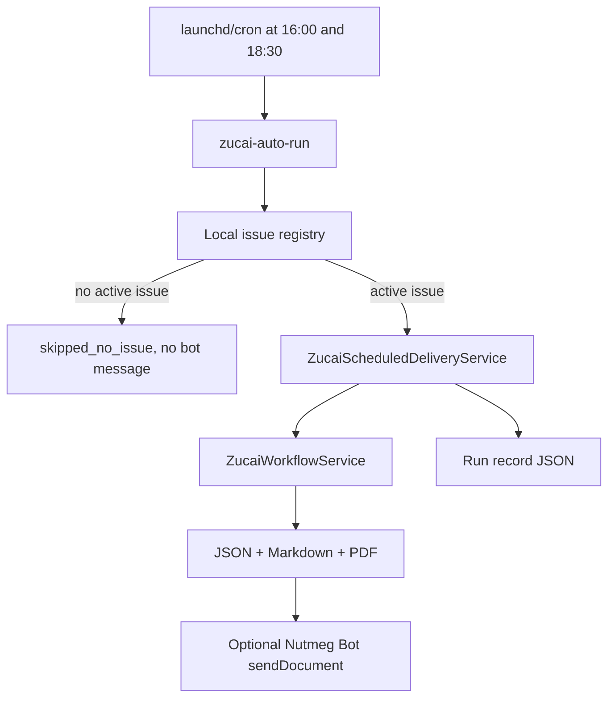

# Zucai Scheduled Delivery Design

Feature: `042-zucai-scheduled-delivery-v0`  
Date: 2026-04-26

## Intent

Traditional足彩14场 is a recurring every-issue workflow. Nutmeg already has a reusable report builder, PDF renderer, and Telegram document sender. This slice turns that manual command into a quiet daily automation: check whether today's issue exists, send the 16:00 first report if it does, send a separate 18:30 revision report, and stay silent on non-issue days.

## Design

## Slot Semantics

- `afternoon`: first report, intended for 16:00 Asia/Shanghai.
- `revision`: decision-confirmation report, intended for 18:30 Asia/Shanghai.

The two slots write separate artifact directories and separate run records. Revision can use slot-specific odds/override snapshots when the registry provides them; otherwise it reuses the base snapshots and labels the report as a revision.

## Safety

- No issue day means no Telegram message.
- Duplicate date/slot/issue runs skip unless `--force` is set.
- Real Telegram send still requires explicit `--dispatch-telegram --no-dry-run` in the scheduled command.
- The service reuses `ZucaiWorkflowService`; it does not duplicate picks or invent a new betting model.
- Reports keep the responsible-use boundary: analysis assistance only, no guaranteed return and no bet execution.

## Future Extension

The registry is intentionally local-first. A future parser/provider feature can populate it from official schedules and trusted odds/news sources without changing scheduler behavior.
