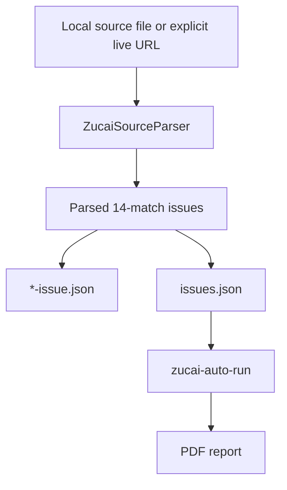

# Zucai Source Parser Design

Feature: `043-zucai-source-parser-v0`  
Date: 2026-04-26

## Intent

`042-zucai-scheduled-delivery-v0` can run silently and send scheduled reports, but it needs `.nutmeg-data/zucai/issues.json` to know whether the day has an active issue. This slice adds a local-first parser that converts official-like traditional足彩 schedule notices into issue snapshots and registry entries.

## Data Flow

## Boundaries

- Parse schedule/issue data only.
- Do not parse or generate odds in this slice.
- Do not place bets or claim guaranteed returns.
- Do not fetch remote URLs unless `--live-fetch` is explicit.
- Preserve operator-maintained odds/override paths when refreshing registry entries.

## Source Notes

Current public schedule notices commonly present sections named like `足球彩票胜负游戏（14场和任选9场）第26068期`, followed by rows containing issue id, competition, sequence number, home team, away team, and match date, then sale/draw timing. The parser uses these textual anchors rather than hard-coding one website's DOM.
