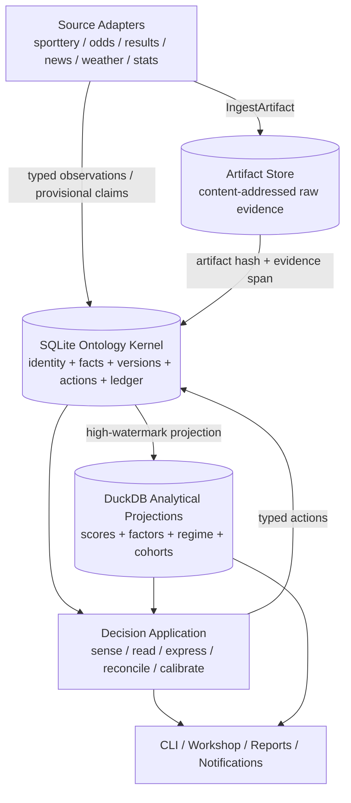
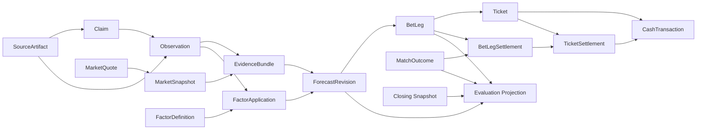

# Nutmeg Ontology Kernel v2

## 足球情报事实层与校准决策控制塔

> 起草：2026-07-20；用户批准：2026-07-21。
>
> 状态：**整体设计已批准，等待实施包计划**。
>
> 本设计是 `2026-07-06-decision-ontology-design.md` 与
> `2026-07-07-ontology-entity-layer-proposal.md` 的下一代目标架构。当前生产链在实施
> Phase 0 冻结前仍以现有五动词 SOP 为准；完成 v2 cutover 后，旧设计转为历史资料。

---

## 0. 已确认的根决策

本设计不是一次“多加几个 dataclass”的扩展。设计讨论明确确认了以下决策：

| 决策 | 选择 | 含义 |
|---|---|---|
| 北极星 | **足球情报事实层托举校准型决策控制塔** | 情报层回答“世界发生了什么”；决策层回答“我们相信什么、做了什么、学到了什么” |
| 系统关系 | **分层一体，不建两个并列产品** | Match/Team/Person/证据身份只有一套；情报与决策不通过脆弱 bridge 维护双真相 |
| 技术路径 | **Ontology Kernel v2 重建** | SQLite 为运行真相，Artifact Store 保存不可变证据，DuckDB 只做可重算分析投影 |
| 迁移连续性 | **允许暂停现有链路后重建** | 不为旧 JSONL/双身份兼容继续固化错误边界；恢复前必须过真实链路验收 |
| 历史迁移 | **证据优先** | 保留不可再生的原始证据、真实 Forecast/Read、真实资金动作与赛果；身份和派生评分重算 |
| AI 写回 | **分级写回** | AI 可写 provisional Claim 和 draft Forecast；不能自行验证事实、提交 Forecast 或批准资金动作 |
| 数据库形态 | **模块化单体，不引入图数据库/事件平台** | Palantir Ontology 的价值来自对象、关系、Logic、Action 与 writeback，不来自数据库品牌 |

完整世界模型不等于无限采集全球足球。v2 采用**按观测物化**：任何被受支持来源观测到、
被决策链引用或被用户主动研究的实体都进入本体；不为“可能有用”预抓整个世界。

---

## 1. 当前系统完整解读

### 1.1 已经做对的部分

当前系统已经完成一次重要的思想转向，不能推倒后遗忘：

1. **Match 是跨通道决策对象。** 竞彩与足彩通过 canonical identity 合并，一场比赛不应因
   表达通道不同而出现两套信念。
2. **市场是先验。** `prior → belief` 明确区分市场共识与主观偏移；无命名理由默认不偏移。
3. **Read、Ticket、Settlement 分层。** 判断、表达和结果没有继续揉成一张旧式“方案”。
4. **五动词形成操作闭环。** `sense → read → express → reconcile → calibrate` 是合理的
   人类操作语言，应保留为应用层接口。
5. **双轴思想正确。** Brier 对最终赛果，closing 对信息吸收速度；投注输赢不是预测质量的
   唯一代理。
6. **反积累纪律正确。** 因子有出生、试用、转正、退休与数量上限，明确反对把每次复盘烤成
   永久规则。
7. **项目已有丰富数据能力。** API-Football、体彩、500、okooo、Open-Meteo、
   Transfermarkt、soccerdata、资讯与事件数据适配器均可作为 v2 source adapters 复用。
8. **工程健康底座尚可。** `tests/decision` 与对应 ruff 检查当前通过；通知 ledger、报告与
   replay 纪律值得继承。

### 1.2 当前运行数据的真实规模

2026-07-20 对工作区只读审计得到：

| 当前资产 | 数量 | 说明 |
|---|---:|---|
| Decision Match | 116 | 92 场带竞彩引用，42 场带足彩引用，18 场实现跨通道合并 |
| MarketSnapshot | 331 | 299 个 read-time，32 个 closing |
| Read | 212 | 107 shadow，105 real；had/hhad/ttg 三轴 |
| Settlement | 240 | 175 条 Read 结算、65 条 Ticket 结算 |
| Ticket | 71 | 总注金流水已存在，但腿级 Forecast 血缘缺失 |
| Team / League | 4 / 7 | 策展实体远少于实际比赛覆盖 |
| DuckDB Fixture | 117 | 与 decision Match 是另一套身份/存储世界 |
| Transfermarkt player cache | 2160 | 球员能力存在，但未进入决策本体 |
| Soccerdata team-match rows | 664 | 状态与 xG 能力存在，但未进入决策证据链 |
| Venue / weather cache | 35 / 37 | 环境数据存在，但未进入 Forecast as-of 输入 |

### 1.3 结构性断层

#### A. 两个足球世界没有合流

- `nutmeg/domain/*` 与 DuckDB 已有 Fixture、Player、天气、场馆、阵容、资讯和事件数据。
- `nutmeg/decision/*` 的新本体只消费 Match、少量 Team/League、盘口和 Read。
- 结果是“丰富情报工具”和“正式决策账本”各有一套身份、时间和存储；情报无法成为可追溯
  Forecast 证据，决策也无法反馈到球员、教练、联赛与环境层学习。

#### B. 实体存在被错误地绑定到“已有知识”

当前 Team/League 的政策是“只为我们已有知识的实体创建对象”。真实结果是 116 场中只有
17 个主队引用、12 个客队引用被解析，实体图保持稀疏。**身份存在**与**知识覆盖**必须分开：
未知球队也是真实实体，只应表现为 `resolution_status=provisional`、知识覆盖低，而不是 null。

#### C. 时间语义不足

当前竞彩与足彩 sense 把 `Match.kickoff_at` 写成 snapshot `taken_at`，并非真实开赛时间。
当前 canonical id 又由日期和原始队名拼接，队名别名或日期口径变化会改变身份。结果包括：

- 无法可靠计算临场距离、证据新鲜度、赛程密度与 closing 时点；
- 无法严格证明 Forecast 没有使用开赛后的信息；
- 同一实体的跨源匹配依赖字符串，而不是外部标识和可审计 resolution。

#### D. JSONL store 不满足其声明的语义

`DecisionStore` 自称 append-only，实际 `upsert` 会读取并重写整份文件。它没有事务、外键、
原子 rename、并发控制或完整 schema migration；坏行被跳过后还可能在下一次重写中永久消失。
`FactorVerdict.id = factor_id` 也意味着每日 verdict 覆盖历史，而不是形成可审计生死轨迹。

#### E. 决策血缘和版本不足

- 真实数据已有 8 组 `(match_id, market)` 重复 real Read；系统无法区分修订、并存意见还是误写。
- 71/71 张 Ticket 没有腿级 `read_id`；当前赢钱或输钱无法回到“当时哪一个 Forecast 导致了它”。
- Read 只删同场 shadow，不会 supersede 旧 real Read；calibrate 可能重复计分。
- `evidence` 只是 Read factor 内的 `{url, quote, at}`，原文、来源健康、冲突与更正都不是一等对象。

#### F. 评分体系有已证实的口径问题

1. 当前 `clv_pp = (belief-prior)·(closing-prior)` 的真实值约为
   `-0.00015..0.00106`，它是概率向量点积，不是 percentage points。
2. 175 条已结 Read 只有 19 条有 CLV；`run_calibrate` 却把 `clv_pp is None` 写成
   `clv_hit=0`，与模块注释“缺失不计入”矛盾，系统性压低因子 CLV 命中率。
3. 每个 Read 含多个 factor 时，当前系统把整条 Brier delta 和 CLV 结果全额记给每个 factor，
   造成重复归功/归罪。
4. “divergent vs shadow”不是 matched comparison：真实判读会替换同场 shadow，两个桶不是同一批
   比赛；正确基线已经在每条 Read 的 `prior` 中，应做同场配对比较。
5. `confidence=1..5` 同时承担方向把握、证据质量和表达许可，混合了不同概念。

#### G. 温度诊断尚不是学习系统

当前 `day-regime.json` 只累计热门均值、固定阈值重热门/均势数、欧体 gap 与期望进球。
截至审计共 14 个日文件（含一个空日），所有日的 gap alert 均为 0；它没有历史 cohort
percentile、资讯冲突、数据健康、阵容不确定性、组合暴露或赛后标签，无法检验“温度”是否有意义。

#### H. 命令面与现行叙事漂移

- 根级 CLI 同时暴露 decision、value-board、Poisson/Kelly、prediction-review、旧 Zucai 报告、
  fixture/player/information 等大量平级命令。
- `AGENTS.md` 的 current plan 仍指向 2026-04 的已退役 mixed-parlay 历史计划。
- README 仍把多个历史分析与 value 工作流描述成可用主路径。

这不是单纯文档陈旧；agent 会据此选择错误世界观。v2 cutover 必须把“唯一正式决策写路径”
落实到代码、命令、文档和自动任务四个层面。

---

## 2. 第一性设计原则

### 2.1 事实、主张、信念、动作、评价必须分开

| 层 | 回答的问题 | 允许的内容 |
|---|---|---|
| Identity | 它是谁？ | Team、Person、Match、CompetitionEdition、Venue、外部 ID |
| Observation | 在某个时间，它处于什么状态？ | 阵容、伤停、天气、球队状态、盘口 Quote |
| Claim | 某来源声称了什么？ | 带原文引用、主体、时效、状态的资讯主张 |
| Forecast | 在当时证据下，我们相信什么？ | prior、belief、FactorApplication、scenario、falsifier |
| Action | 我们正式做了什么？ | commit/revise Forecast、approve Ticket、资金流水、结算 |
| Evaluation | 结果说明什么？ | Brier/CLV/校准/因子估计/Regime 研究投影 |

Claim 不是 Observation；Observation 不是 Forecast；Forecast 不是 Ticket；Ticket 的短期盈亏也
不是 Forecast 质量。这些边界由 schema 和 typed actions 强制，而非靠 SOP 提醒。

### 2.2 对象晋升判据

一个概念满足以下任一高价值条件时才建一等对象：

1. 需要跨来源解析为同一身份；
2. 需要随时间保留状态历史；
3. 有 Action 或权限附着；
4. 被多个对象独立引用并要求血缘；
5. 有独立生命周期或更正语义。

仅一次出现的测量值、罕见 provider payload 或尚未证明有跨场价值的字段，留在带 schema 的
Observation payload，不为“看起来完整”新增对象类型。

### 2.3 Match 与双方不是二选一

- Team 是跨场持久节点；Person 是跨队、跨赛季持久节点。
- Match 是两支 Team 在某个 CompetitionEdition、Venue 与时间下发生的一等事件。
- TeamAppearance 与 PersonMatchStatus 承载“今晚的这支队/这个人”，不污染长期实体。
- 战术相性、赛制激励和联合概率属于 Match/两侧关系，不能硬塞给任一 Team。

### 2.4 赔率不是资金流

赔率是价格与信息状态。只有来源提供真实成交量、投注比例或资金净流时，才创建
`MarketFlowObservation`。用户自己的资金只存在于 Ticket、CashTransaction 与 TicketSettlement。
禁止从赔率移动直接命名“资金流入/流出”。

### 2.5 派生结果必须可重算

SQLite 保存不可替代的运行事实与动作；原始内容保存在 Artifact Store；所有评分、因子估计、
温度向量和报表都从二者投影到 DuckDB，可按 `projection_version` 全量重建。

---

## 3. 目标分层架构



### 3.1 模块职责

- **Ontology Kernel**：唯一运行真相；只关心对象、关系、版本、状态机、权限、不变量和事务。
- **Ingest**：来源适配、原文落盘、确定性解析、去水与标准化；不得生成判断。
- **Decision Application**：五动词与 typed actions 的 use cases；不直接操作数据库文件。
- **Analytics**：只读投影与可重算算法；不能成为第二个业务写入源。
- **Interfaces**：CLI、Workshop、报告与通知；不复制业务判断。

---

## 4. 核心对象模型

### 4.1 稳定身份骨架

#### CompetitionEdition

一项赛事的具体版本，而不是模糊联赛字符串。

```text
competition_edition_id
competition_id
name / country / format
season_label
stage / round_definition
valid_from / valid_to
```

`Competition` 表示长期赛事身份；`CompetitionEdition` 表示 2026 瑞超、2026 世界杯等具体环境。

#### Team

```text
team_id
team_kind: club | national | selection
canonical_name
country
resolution_status: provisional | resolved | merged | retired
created_at
```

每个受支持来源观测到的参赛方都获得 provisional Team。知识覆盖、画像与校准样本是独立投影，
不决定 Team 是否存在。

#### Person

```text
person_id
canonical_name
birth_date?
nationality?
resolution_status
created_at
```

球员、教练、裁判统一为 Person。具体身份通过 `RoleAssignment.role_type` 表达，不建互斥的
Player/Coach 根类型；同一人从球员转教练时身份不变。

#### Venue

```text
venue_id
canonical_name
country / latitude / longitude / timezone
resolution_status
```

#### Match

```text
Match {match_id, current_revision_id}  # 内部稳定 opaque id，不含队名

MatchRevision {
  match_revision_id, match_id, version,
  competition_edition_id,
  scheduled_at,                  # 真实开赛时间；未知必须显式 unknown，不用抓取时间代替
  venue_id?,
  status: scheduled | live | finished | postponed | cancelled,
  round_label?, recorded_at, supersedes_revision_id?
}
```

Provider event id、竞彩号、足彩期号/序号全部进入 `ExternalIdentifier`，不是 Match 主键。
参赛双方由 `TeamAppearance(match_id, team_id, side)` 关联；标准足球 Match 必须恰有两个
TeamAppearance、一个 designated home 和一个 designated away（中立场也保留票面主客角色），
避免 Match 与 TeamAppearance 形成双向外键循环。

#### ExternalIdentifier 与 EntityMerge

```text
ExternalIdentifier {entity_id, entity_type, provider, external_id, valid_from?, valid_to?}
EntityAlias        {entity_id, normalized_alias, language?, provider?}
EntityMerge        {from_id, into_id, reason, evidence_retrieval_ids, actor, at, reversible}
```

身份 resolve 先用 provider ID，再用策展 alias 和受控 fingerprint；不执行无日志 fuzzy merge。
merge 不删除历史行，所有旧引用经 redirect view 解析到 survivor。

### 4.2 时态关系与比赛上下文

#### RoleAssignment

```text
role_assignment_id
person_id
team_id
role_type: player | head_coach | assistant_coach | medical | other
position_group?
valid_from / valid_to
source_observation_id
```

#### TeamAppearance

一支 Team 在一场 Match 中的情境化节点。

```text
team_appearance_id
match_id / team_id
side: home | away | neutral_designated_home | neutral_designated_away
```

TeamAppearance 只表达稳定的参赛关系，不复制动态状态。rest、travel、condition、motivation、
expected formation 等全部作为带来源与时效的 typed Observation 挂在 TeamAppearance；confirmed
formation 由 LineupEntry 投影。这样“状态 ≠ 战意”既能结构化，也不会丢失证据血缘。

#### PersonMatchStatus

```text
person_match_status_id
match_id / person_id / team_appearance_id
availability: expected | available | doubtful | out | suspended | returned
status_kind: injury | suspension | rotation | selection | coach_status
valid_from / valid_to
observation_id
```

#### LineupEntry

```text
lineup_entry_id
match_id / person_id / team_appearance_id
lineup_status: expected | confirmed
role: starter | substitute | unavailable
position / shirt_number / captain
observed_at / observation_id
```

### 4.3 证据与资讯流

#### SourceArtifact

```text
artifact_id                     # sha256:<digest>
first_recorded_at
content_type
storage_path
byte_size
content_hash
```

原文、API 响应、盘口快照、公告、网页与用户上传文件均先进入内容寻址存储。同样内容重复抓取只
增加 `ArtifactRetrieval {artifact_retrieval_id, artifact_id, source_run_id, source_name,
source_type, reported_content_type, canonical_url?, requested_url?, published_at?, retrieved_at, status}`，
不复制正文，
也不把一个内容哈希错误地绑定到某个来源或单次抓取运行。

#### Claim

```text
claim_id
subject_type / subject_id
predicate
value_json
scope_match_id?
valid_from / valid_to?
status: provisional | corroborated | verified | disputed | expired | retracted
extractor / extractor_version
evidence_spans: [{artifact_id, artifact_retrieval_id, quote, locator}]
created_at / adjudicated_at?
```

允许多个相互冲突的 Claim 共存。`VerifyClaim`、`DisputeClaim`、`RetractClaim` 是显式 Action，
不会覆盖原主张。Claim 内容 immutable；表中的 `status` 是 current projection，每次转换另追加
`ClaimStatusEvent {claim_id, from_status, to_status, action_id, at}`，可重放其完整裁决轨迹。

#### Observation

```text
observation_id
observation_type
subject_type / subject_id
scope_match_id?
value_json / schema_version
valid_from / valid_to?
observed_at
recorded_at
source_artifact_retrieval_ids[]
claim_ids[]
verification_method: deterministic | official | corroborated | adjudicated
quality_json
```

天气、阵容、伤停、休息、球队近期指标、赛制状态等使用 typed observation schema。

#### EvidenceBundle

Forecast 的不可变 as-of 输入清单：

```text
evidence_bundle_id
match_id
frozen_at
information_cutoff_at
market_snapshot_id
verified_observation_ids[]
supporting_artifact_retrieval_ids[]
caveat_claim_ids[]              # provisional/disputed 仅作风险提示，不能许可偏移
identity_resolution_version
source_coverage_json
freshness_json
content_hash
```

Bundle 冻结后不可修改。新增资讯必须创建新 Bundle 和新 ForecastRevision。

### 4.4 市场价格流

#### MarketDefinition 与 SelectionDefinition

统一玩法、结果口径和线值：

```text
MarketDefinition {market_definition_id, market_kind, settlement_scope,
                  ordered, line_schema?, outcome_schema_version}
SelectionDefinition {selection_id, market_definition_id, outcome_key, line?}
```

`settlement_scope` 显式区分 90 分钟、含加时、点球晋级等口径。

#### MarketQuote

```text
quote_id
match_id / market_definition_id / selection_id
provider / bookmaker?
decimal_odds
captured_at
artifact_retrieval_id
quote_status
```

#### MarketSnapshot

```text
market_snapshot_id
match_id / market_definition_id
snapshot_kind: read_time | closing | intermediate
as_of
source_quote_ids[]
fair_distribution
devig_method / method_version
source_coverage / freshness / disagreement
```

`MarketFlowObservation` 仅在来源真的提供成交量、投注比例或净流时使用；没有该数据时不创建。

### 4.5 信念与因子

#### DecisionSession

一轮判读的工作单元，保存操作者、目标比赛集合、cutoff、输入/输出状态和运行健康。它让“今天
明确看过但选择跟市场/空仓”成为正式动作，而不需要伪造 shadow Read。

#### ForecastSeries 与 ForecastRevision

`Read` 保留为用户界面用语；正式持久对象是可修订 Forecast：

```text
ForecastSeries {
  forecast_series_id, match_id, market_definition_id
}

ForecastRevision {
  forecast_revision_id, forecast_series_id, decision_session_id, revision_no,
  status: draft | committed | superseded | withdrawn,
  made_at, information_cutoff_at,
  prior_snapshot_id, prior_distribution,
  belief_distribution,
  evidence_bundle_id,
  factor_application_ids[], scenario_ids[], falsifier,
  actor_id, model_name, model_version, policy_version,
  supersedes_revision_id?
}
```

关键不变量：

- 同一 series 最多一个 committed current revision；
- revision 提交后不可原地编辑；
- `belief=prior` 可以表示主循环明确判断后跟市场；
- 未判比赛的市场基线由 analytics 从 prior 生成，不再写大量 operational shadow objects；
- committed revision 只能引用 cutoff 前已记录且当时有效的证据。

#### FactorDefinition 与 FactorApplication

```text
FactorDefinition {
  factor_definition_id, factor_family_id, version,
  name, definition, scope,
  status: probation | active | retired,
  born_from_refs[], valid_from, valid_to?, policy_version
}

FactorApplication {
  factor_application_id, forecast_revision_id, factor_definition_id,
  scope_entity_ids[],
  delta_distribution,            # 对每个 outcome 的有符号概率偏移，和为 0
  supporting_observation_ids[],
  note
}
```

所有 `delta_distribution` 相加必须精确重建 `belief-prior`。定义发生语义变化时创建新 version，
不能把新旧含义混在同一 factor 样本中。

### 4.6 行动、资金与结果

#### BudgetPolicy

预算、桶位、审批权限和风险上限是版本化 policy data，不写成散落 if。Policy 的更改也是 Action。

#### TicketProposal、Ticket 与 BetLeg

```text
TicketProposal {proposal_id, decision_session_id, policy_version,
                proposed_legs[], proposed_stake, status}

Ticket {ticket_id, channel, approved_at, status, structure,
        total_stake, currency, account_id, proposal_id}

BetLeg {bet_leg_id, ticket_id, forecast_revision_id,
        match_id, market_definition_id, selection_id,
        entry_quote_id, line?, stake_share?}
```

每条 BetLeg 必须引用 committed ForecastRevision 和准确 entry quote。空 proposal/空仓是合法结果。

#### CashAccount 与 CashTransaction

```text
CashAccount {account_id, channel_scope, currency, status}
CashTransaction {transaction_id, account_id, ticket_id?, ticket_settlement_id?,
                 kind: stake | payout | adjustment,
                 amount, occurred_at, idempotency_key}
```

竞彩与传统足彩可以有独立预算 policy，但最终进入同一资金流水语义。

#### MatchOutcome、BetLegSettlement 与 TicketSettlement

```text
MatchOutcome {outcome_id, match_id, version,
              score_90, score_aet?, penalties?, status,
              source_artifact_retrieval_ids[], recorded_at, supersedes?}

BetLegSettlement {bet_leg_settlement_id, bet_leg_id, outcome_id,
                  grade, hit?, settlement_method_version}

TicketSettlement {ticket_settlement_id, ticket_id, settled_at,
                  status, stake_amount, payout_amount, pnl_amount,
                  bet_leg_settlement_ids[], settlement_method_version}
```

赛果修正创建新 Outcome version，并触发 BetLeg/Ticket Settlement 与 analytics 重建；不覆盖原结果。
Forecast 不产生 operational Settlement；它的 Brier/closing/calibration 全部属于可重算 Evaluation
projection。这样“预测评价”不会再次混入“真实资金结算”。

### 4.7 评价对象的存储边界

SQLite 只保存 `EvaluationRun` 的版本、输入 high-watermark、算法版本、状态和产物摘要。逐条
ForecastScore、FactorEstimate、RegimeVector 与校准分桶存在 DuckDB，因为它们可从 immutable
inputs 重算，不应成为第二个手工维护的真相源。

---

## 5. 血缘图与时态纪律



### 5.1 四种时间不可混用

| 字段 | 含义 | 示例 |
|---|---|---|
| `valid_from/to` | 世界中该事实何时有效 | 球员伤停从周一到周五 |
| `published_at` | 来源何时公开 | 俱乐部公告发布时间 |
| `retrieved_at/recorded_at` | Nutmeg 何时知道 | 系统周三 14:00 抓到公告 |
| `information_cutoff_at` | Forecast 禁止越过的证据线 | 判读在周三 15:00 冻结输入 |

Forecast 可以使用 `published_at` 更早但 `recorded_at` 晚于 cutoff 的证据吗？**不可以**。系统只
能用当时已经实际获得的证据，避免历史回放未来泄漏。

---

## 6. Typed Actions 与权限

### 6.1 Action envelope

所有正式写入通过统一 command envelope：

```text
action_id
action_type
actor_id / actor_role
requested_at
idempotency_key
expected_versions{}
payload
policy_version
status: accepted | rejected | committed | failed
result_refs[]
error_code / error_detail?
committed_at?
```

SQLite transaction 同时提交业务对象和 action log，不能出现“Ticket 写了但资金流水没写”的半状态。

### 6.2 权限矩阵

| Actor | 可以写 | 不可以写 |
|---|---|---|
| Connector | Artifact、外部 ID 候选、Quote、确定性 Observation | Claim verified、Forecast、Ticket |
| AI Extractor | provisional Claim、实体匹配候选 | verified Observation、Forecast commit |
| AI Analyst | draft Forecast、Factor/Claim review proposal | 自行 commit、批准资金动作 |
| Judge/Operator | Claim 裁决、Forecast commit/revise/withdraw、Ticket approve、Policy approve | 绕过 validator 直接写表 |
| Deterministic System | 去水 Snapshot、Bundle freeze、Policy validation、Outcome ingest、BetLeg/Ticket Settlement、EvaluationRun；满足官方结构化来源/交叉验证 policy 时执行 Claim 验证 | 选择投注方向、凭模型措辞自行验证 Claim、编造缺失值 |

在单用户系统中，Judge/Operator 可以由主循环最新模型在用户授权范围内扮演，但 actor、model
version 与 action 仍必须落库；“主循环可以判断”不等于“可以绕过 schema”。

### 6.3 关键 Actions

`IngestArtifact` · `ProposeIdentityLink` · `MergeEntity` · `SplitEntity` · `ExtractClaim` ·
`VerifyClaim` · `DisputeClaim` · `RecordObservation` · `RecordMarketQuote` ·
`FreezeEvidenceBundle` · `DraftForecast` · `CommitForecast` · `ReviseForecast` ·
`WithdrawForecast` · `ProposeTicket` · `ApproveTicket` · `RecordCashTransaction` ·
`CaptureClosing` · `RecordOutcome` · `CorrectOutcome` · `SettleTicket` ·
`BuildProjection` · `ProposeFactorStatus` · `ApplyFactorStatus` · `ChangeBudgetPolicy`。

---

## 7. 五动词在 v2 中的映射

### 7.1 sense：感知世界，不做判断

1. 拉取来源并执行 `IngestArtifact`；内容哈希保证幂等。
2. 解析 provider identity，创建 provisional entity 或提出 merge 候选。
3. 写 MarketQuote，并确定性生成 MarketSnapshot。
4. AI/规则抽取 provisional Claim；官方结构化字段可直接生成 deterministic Observation。
5. 写 `SourceRun` 与 `SourceHealth`，显式标记 complete/partial/stale/unavailable。

失败源不能用空响应覆盖上一条好数据；旧数据仍可见，但 freshness 会下降。

### 7.2 read：冻结证据后形成可修订 Forecast

1. 创建 DecisionSession；选择研究比赛不是偷偷发生的默认行为。
2. `FreezeEvidenceBundle` 焊死 cutoff、prior、verified observations 与 caveats。
3. Analyst 形成 draft Forecast；validator 检查概率、Factor delta、证据状态、市场口径和权限。
4. Judge 执行 Commit/Revise/Withdraw。
5. 明确跟市场时提交 `belief=prior`；未研究比赛不创建 fake Read，analytics 用 prior 作全量基线。

### 7.3 express：把 Forecast 变成受 policy 约束的行动

1. 只从 current committed Forecast 生成 TicketProposal。
2. Policy validator 检查玩法、line、概率来源、相关性、预算、单注和总额。
3. ApproveTicket 在同一事务中写 Ticket、BetLeg、CashTransaction。
4. 没有合格 proposal 时提交 no-action/空仓结果；预算上限不是自动填满任务。

这会修正当前 `compose_tickets`“每个有腿 bucket 占满 cap”的实现语义，使其与“上限不是任务”一致。

### 7.4 reconcile：记录事实和资金结果

1. CaptureClosing 保存同玩法、同 selection、同 line 的 closing quotes/snapshot。
2. RecordOutcome 显式保存 90 分钟、加时、点球与终局状态。
3. BetLeg/Ticket Settlement 只在结果充分时生成；缺失保持 unavailable，不制造 pending 输票。
4. Outcome/price 更正触发新版本与重算，不覆盖历史。

### 7.5 calibrate：提出学习动作，不静默改变世界

1. 从 SQLite high-watermark 重建 DuckDB projections。
2. 产生 Forecast、Market、Calibration、Integrity、Action 五类 scorecards。
3. 产生 FactorEstimate 与 Regime 研究结果。
4. 因子转正/退休先生成 `ProposeFactorStatus`，再按批准 policy 执行显式 Action。
5. 报告所有指标的 n、coverage、时间窗口、cohort 与 algorithm version。

---

## 8. 存储设计

### 8.1 SQLite：唯一 operational truth

运行库固定为 `.nutmeg-data/ontology/ontology.db`，与通知/客户端状态使用的 `state.db` 分离。
使用现有 SQLAlchemy 依赖的 Core 层加显式编号 migration，不引入通用 ORM 魔法。数据模型采用
typed relational tables，不使用“万能 objects + links + payload”的纯 EAV 模型。表组如下：

```text
identity:
  competitions, competition_editions, teams, persons, venues, matches, match_revisions
  external_identifiers, entity_aliases, entity_merges

context:
  role_assignments, team_appearances, person_match_statuses, lineup_entries

evidence:
  source_artifacts, artifact_retrievals, source_runs, source_health
  claims, claim_status_events, claim_evidence_spans, observations, observation_sources
  evidence_bundles, evidence_bundle_items

market:
  market_definitions, selection_definitions, market_quotes, market_snapshots
  market_snapshot_quotes

decision:
  decision_sessions, forecast_series, forecast_revisions
  factor_families, factor_definitions, factor_applications, scenarios

finance/outcome:
  budget_policies, ticket_proposals, tickets, bet_legs
  cash_accounts, cash_transactions, match_outcomes
  bet_leg_settlements, ticket_settlements

governance:
  actions, policy_versions, schema_migrations, evaluation_runs
```

概率分布、provider payload、quality details 等边界数据可用 JSON，但必须有 `schema_version` 和
应用层 validator。高价值关系必须用外键/关联表，不埋在自由 JSON 中。

### 8.2 版本策略：typed current state + append-only history

v2 不追求所有对象的纯 event sourcing。采用更易维护的混合方式：

- ForecastRevision、Claim 状态、Outcome 更正、Policy、FactorDefinition 天然追加版本；
- Team/Person 等实体有 current row，所有 merge/split/关键更正写 Action log；
- 任何 Action 使用 optimistic expected version 与 idempotency key；
- 启用 SQLite foreign keys、WAL 与单写 Unit of Work；
- 业务代码不能绕过 repository 直接执行任意 SQL。

### 8.3 Artifact Store

路径形态：

```text
.nutmeg-data/ontology/artifacts/sha256/<first-2>/<digest>
```

数据库保存 metadata 与 storage path。文件写入采用临时文件 + fsync + atomic rename；数据库
transaction 只在 artifact durable 后引用它。原始证据不做 in-place 编辑。

### 8.4 DuckDB：只读于业务、可全量重建

DuckDB projection table 每行带：

```text
projection_name
projection_version
source_high_watermark
built_at
cohort_definition_version
metric_version
```

业务命令不直接写 analytics tables。Projector 从 SQLite snapshot/high-watermark 构建，失败时
保留上一版成功投影并将新 run 标 failed。

---

## 9. 评分分析体系

### 9.1 不设单一“系统总分”

系统同时展示五张独立计分卡：

1. **Forecast Truth**：预测是否校准、是否优于同场市场先验；
2. **Market Information**：是否提前吸收了后来进入 closing 的信息；
3. **Calibration & Selectivity**：自称的概率与选择性参与是否可信；
4. **Evidence & Process Integrity**：输入、血缘、时效与覆盖是否可靠；
5. **Action & Finance**：表达是否忠实、预算是否合规、真实资金结果与风险如何。

赚钱不能漂白坏概率；高 Brier 技能也不能漂白无血缘或违规资金动作。

### 9.2 Forecast Truth

对 K 结果分布 `q` 与 one-hot 结果 `y`：

```text
BS(q, y) = Σ_k (q_k - y_k)^2
```

相对同场 prior `p` 的 cohort skill：

```text
Brier Skill Score = 1 - Σ_i BS(q_i, y_i) / Σ_i BS(p_i, y_i)
```

大于 0 表示该 cohort 总体优于市场先验。报告 raw Brier、prior Brier、skill、n、coverage 与
bootstrap/Bayesian interval；若 cohort 的 prior Brier 分母为 0，则 skill 标 unavailable，禁止
除零或补默认值。禁止只报一个方向命中率。

同时使用：

- **Log Score**：惩罚过度自信；概率 clip 规则版本化；
- **RPS**：用于 total goals、净胜球等有序结果；
- **Market-specific score contract**：每个 MarketDefinition 声明适用评分与 settlement scope。

### 9.3 Market Information 与正确 CLV 口径

#### Forecast Closing Skill

令 `c` 为同市场 closing fair：

```text
closing_skill_delta = BS(q, c) - BS(p, c)
```

负值表示 belief 比 read-time prior 更接近 closing。closing 是 soft information benchmark，
不是最终 truth。

#### Directional Alignment

现有指标保留但改名：

```text
directional_alignment = (q - p) · (c - p)
```

正值表示偏移方向与 closing 移动一致。它是概率平方量纲，不叫 `clv_pp`。

#### Ticket Price CLV

仅在同 market、selection、line 可比较时：

```text
ticket_clv_log = log(entry_decimal_odds / closing_decimal_odds)
```

正值表示拿到优于收盘的价格。玩法/line 变化无法规范比较时标 `not_comparable`，不做近似伪造。

所有 closing 指标必须显示 `closing_coverage` 与 freshness；缺失从对应分母排除。

### 9.4 Calibration 与选择性参与

- Reliability curve 与 adaptive-bin ECE；
- 样本足够时计算 calibration intercept/slope 与区间；
- coverage-skill curve：按参与门槛展示覆盖率下降时 skill 是否上升；
- 同时展示明确 follow-market、divergent 和 no-decision，但 paired baseline 始终来自同场 prior；
- 按 market、competition、judge/model version、time-to-kickoff 与 evidence coverage 分 cohort。

### 9.5 Confidence 拆分

不再用单个 conf1-5 混合所有概念：

| 字段 | 含义 |
|---|---|
| `belief_distribution` | 对比赛结果本身的概率判断 |
| `evidence_coverage` | 关键证据槽覆盖程度 |
| `evidence_quality` | 来源可靠、新鲜、交叉验证与冲突情况 |
| `forecast_stability` | 新证据到来时 belief 的敏感度/修订幅度 |
| `commitment_tier` | follow / lean / commit，供表达 policy 使用 |

UI 可以把这些投影成易读标签，但原始维度必须可见。

### 9.6 Integrity 与 Action 计分

Integrity 面板至少包含：identity resolution、source coverage/freshness、claim contradiction、
lineage completeness、closing coverage、outcome completeness、projection lag。

Action 面板至少包含：policy compliance、forecast-to-ticket fidelity、stake/payout ledger balance、
yield、ROI、drawdown、exposure concentration 与相关性簇。财务指标按真实 Transaction 计算，
“没入账 = 没打”继续成立。

---

## 10. Factor 学习与生命周期

### 10.1 从标量标签变为概率偏移分解

每条 FactorApplication 保存 outcome-level `delta_distribution`，满足：

```text
Σ_factor delta_factor = belief - prior
Σ_outcome delta_factor = 0
```

这使系统能回答“哪一个因子把 home 从 46% 推到 41%，哪个因子把 draw 推到 32%”，而不是
只有绝对 `weight_pp`。

### 10.2 多因子归因

- 单 factor Read：paired score contribution 可直接计算；
- 多 factor Read：使用基于 delta 子集的 Shapley score attribution，把 Brier/closing skill 的
  联合增益公平分配；
- validator 必须确认总 belief 位于概率 simplex；Shapley 所需的任一 factor 子集若产生非法
  中间分布，则该条多因子 attribution 标 `confounded_not_attributable`，不得投影/裁剪后伪分功劳；
- 同时保留 raw cohort estimate，避免 Shapley 结果被误解为因果效应；
- FactorEstimate 按 factor family/version、scope、market 与 cohort 分层，并使用 shrinkage 与
  uncertainty interval；小样本向全局均值收缩，不报极端命中率；
- scope-specific estimate 是诊断，不建立大量独立生死状态机。

### 10.3 生命周期 policy

Factor status 变更由版本化 policy 读取以下证据：

- effective sample size；
- Brier skill contribution 区间；
- closing skill contribution 与 coverage；
- 跨 cohort 稳定性；
- evidence integrity；
- 多重比较/词典容量。

不再把 `n=30` 与 `CLV>55%` 硬编码为永恒真理。默认仍保留 active factor 上限 12，但阈值属于
PolicyVersion。任何转正/退休先产 proposal，再通过 typed Action 应用；Factor 定义一旦改变即
升版本，历史样本不混池。

---

## 11. 整体温度感知：RegimeVector

### 11.1 定位

RegimeVector 是带 `as_of` 的赛前环境观察，首先用于：

1. 决定研究资源投向哪里；
2. 按环境分层评价 Forecast/Factor；
3. 暴露数据与组合风险；
4. 积累可验证假设。

它是**温度计，不是恒温器**。未经历史验证和 Policy 批准，不得直接改变胜平负方向、自动反热门
或加减仓。

### 11.2 五组传感器

#### 市场形态

- fair distribution normalized entropy；
- favorite concentration / draw mass；
- 跨来源 Jensen-Shannon divergence；
- 价格移动的 magnitude、velocity 与 breadth；
- total-goals environment；
- quote coverage 与 freshness。

#### 资讯天气

- 新增 Claim 数与 verified novelty；
- provisional/disputed/contradictory 比率；
- lineup uncertainty；
- 关键 PersonMatchStatus 变化；
- 来源可靠度与抓取延迟。

#### 比赛压力

- rest、travel、schedule congestion；
- weather severity；
- coach/roster volatility；
- 由 verified Observation 支撑的赛制/晋级激励；
- neutral venue 与时区影响。

#### 数据健康

- source success/partial/stale/unavailable；
- identity quarantine 数；
- key-slot coverage；
- read-time/closing availability；
- projection lag。

#### 组合风险

- stake utilization；
- Team/League/market exposure concentration；
- 同一叙事/同一 prior source 的相关性簇；
- parlay dependency 与 tail exposure。

### 11.3 输出 schema

```text
RegimeVector {
  regime_id, scope_type: match | slate, scope_id, as_of,
  axes: {
    market_shape: {raw, cohort_percentile, coverage, uncertainty},
    information_weather: {...},
    fixture_pressure: {...},
    data_health: {...},
    portfolio_risk: {...}
  },
  labels[],
  cohort_definition_version,
  projection_version
}
```

percentile 必须相对可比较 cohort（competition/season、距离开赛阶段、slate size），不能把世界杯
决赛与 18 场北欧周末盘放进同一分布。允许多标签，如“共识平静”“热门堆积”“信息冲突”
“临场冲击”“数据贫瘠”，不压成单一冷热分。cohort 历史不足时只展示 raw value、coverage 与
`percentile_unavailable`，不借用不相干联赛补基线。

### 11.4 赛后研究标签

赛后可计算 market Brier residual、upset surprise、goal surprise、closing movement realization 等，
用于验证赛前 regime 是否有解释力。赛后标签与赛前向量分表，禁止回填造成未来泄漏。

当前 `day-regime.json` 作为历史诊断 Artifact 迁入；它的固定阈值字段不直接成为 v2 因子。

---

## 12. 目标代码边界与命令面

### 12.1 目录形态

```text
nutmeg/
  ontology/
    identity/        # Match/Team/Person/Competition/Venue + resolution
    evidence/        # Artifact/Claim/Observation/EvidenceBundle
    market/          # Definition/Quote/Snapshot
    decision/        # Forecast/Factor/Scenario
    finance/         # Budget/Ticket/Ledger/TicketSettlement
    actions/         # commands/handlers/permissions/validators
    repository/      # SQLite schema/migrations/unit-of-work
  ingest/            # provider adapters; no judgment
  decision/          # five-verb application services/facade
  analytics/         # DuckDB projectors/scoring/factors/regime
  interfaces/        # CLI/Workshop/report/notifications
  research/          # optional isolated models; no production write authority
```

模块可以按实施包渐进搬迁，但最终禁止 `interfaces` 或 `research` 直接 import repository internals。

### 12.2 现有资产处置

| 处置 | 资产 | 原因 |
|---|---|---|
| 保留并适配 | `nutmeg/data/*` 来源客户端 | 作为 ingest adapter；已有 WAF、降级与 source-specific 经验 |
| 保留并适配 | 去水、盘口解析、赛果结算纯函数 | 确定性数学可复用，需挂 metric/method version |
| 保留并适配 | `nutmeg/notifications/*`、PDF/Telegram transport | 可靠 delivery ledger 已与业务解耦 |
| 保留思想、重接数据 | Workshop typed approval/thread | UI 不再读 JSONL，全部走 application query/action API |
| 重写 | `decision/ontology.py`、`store.py`、`entities.py` | 九对象/JSONL/策展身份不足以承载 v2 |
| 重写 | sense/read_ingest/express/reconcile/calibrate/day_regime | 改为 typed action handlers 与 analytics projectors |
| 迁入事实层 | FixtureSnapshot、PlayerProfile、Information、Weather/Event data | 由独立 DTO/缓存能力变为 Observation/Claim/Role 等正式证据 |
| 合并 | prediction-record/review、zucai 独立判断/账本 | 统一为 Forecast/Evaluation 与同一 Ledger；通道仅是表达属性 |
| 退役或隔离 | value-board、Poisson/Kelly 等与现 SOP 冲突的决策入口 | 不得形成第二个正式判断写路径；如保留，只在 research namespace |
| 只读归档 | 历史 engine report、betting_plan、旧 verdict | 作为证据/考古，不作为 v2 当前状态 |

### 12.3 命令面

扁平 50+ 命令重组为四个明确命名空间：

```text
nutmeg ontology ...   # ingest / resolve / inspect / health
nutmeg decision ...   # sense / read / express / reconcile / calibrate / run
nutmeg research ...   # 明确非生产的模型与可视化
nutmeg ops ...        # notification / scheduler / doctor / backup / audit
```

竞彩与足彩是 `channel`/expression policy，不是两台信念引擎。旧命令在暂停重建期间不要求兼容；
cutover 时删除或提供短期报错型迁移提示，不能长期保留隐形双路径。

### 12.4 文档治理

- 本设计是 umbrella architecture contract；五个实施包各自有 spec/plan。
- `AGENTS.md` 与 `CLAUDE.md` 仍保持同一 SOP harness 副本。
- `.specify/.../plan.md` 指针在 Package 1 plan 产生后改指当前 v2 umbrella/package plan；不得再指
  2026-04 mixed-parlay 历史计划。
- README 只展示 ontology-native 正式入口；research 与历史命令单列且明确无生产写权限。

---

## 13. 证据优先迁移与 cutover

### 13.1 Phase 0：Freeze，不做破坏性删除

在开始代码迁移前执行并记录：

1. 停止 decision am/close/settle 与相关足彩自动任务；
2. 复制并哈希 `.nutmeg-data/jczq`、`.nutmeg-data/zucai`、analytics DuckDB 与 state DB；
3. 导出当前对象数量、文件 hash、schema 与全套验证结果；
4. 原目录转只读 archive，所有迁移从副本或只读源运行；
5. 不删除用户脚本、memory、media 或无关工作区改动。

用户已批准允许暂停，但停任务仍必须由实施计划中的显式、可验证步骤执行。

### 13.2 五个独立实施包

#### Package 1 — Kernel & Governance

交付：SQLite schema、migrations、Artifact CAS、Unit of Work、Action envelope、权限、版本和不变量。
它不接 live provider，不迁历史业务对象；先把写入语义做正确。

#### Package 2 — Football World & Evidence

交付：identity resolver、Match/Team/Person/Competition/Venue、Role/Appearance、Claim/Observation、
Market ingest；把现有 Fixture/Player/Weather/Information 能力接入唯一事实层。

#### Package 3 — Decision & Finance Loop

交付：EvidenceBundle、Forecast revisions、FactorApplication、Ticket/Ledger、Outcome/TicketSettlement 与
五动词 facade；竞彩/足彩共享信念层与资金语义。

#### Package 4 — Learning & Regime

交付：DuckDB projections、五张 scorecards、factor attribution/lifecycle proposals、RegimeVector、
校准报告与 Workshop 查询模型。

#### Package 5 — Evidence Migration & Cutover

交付：历史 importer、reconciliation report、CLI/Workshop 重接、文档统一、真实链 replay、旧写路径
关闭与 schedule 恢复。

每个 Package 都必须独立经历 spec → plan → TDD → project verify，不把五包塞进一份巨型 plan。

### 13.3 历史对象迁移规则

以审计时 116 Match / 331 Snapshot / 212 Read / 71 Ticket / 240 Settlement 为基线：

| 旧数据 | v2 处置 |
|---|---|
| sporttery/bold odds/API 原文件 | SourceArtifact，保留 hash 与 retrieval 时间 |
| Match | 重新解析真实 scheduled_at、Team/Competition 外部 ID；原 id 存 legacy identifier |
| Team/League seeds | 作为 resolution/Observation 输入，不再是唯一可创建实体集合 |
| MarketSnapshot | 从原 quote/artifact 重建；无法拆 quote 时标 migrated_aggregate |
| real Read | 迁为 ForecastRevision，保留原 prior/belief/judge/made_at 与 migration quality |
| shadow Read | 不迁 operational object；由 prior 在 analytics 重建 baseline |
| 重复 real Read | 按 made_at/revision 证据建立 series；无法确定顺序时并存并标 migration ambiguity，不重复评分 |
| Factor | 迁 Definition v1；旧 Verdict 不迁为当前状态，统一重算 |
| Ticket | 保留真实资金动作；能唯一关联时补 Forecast，不能则标 `lineage_unresolved`，绝不猜接 |
| Read Settlement | 提取 Outcome/closing 引用后转为 DuckDB ForecastScore；不迁 operational Settlement |
| Ticket Settlement | 拆为 BetLegSettlement + TicketSettlement；关联 v2 Outcome 后重算，原数值保留 legacy audit field |
| calibration/day-regime/report | 作为 Artifact；派生指标不迁为真相 |
| DuckDB betting_plan 历史 | 只读归档；只有能证明真实下注的记录才进入 Ledger |

每个 importer 支持 dry-run、幂等 rerun、逐类 counts、unresolved 列表和 source-to-target hash manifest。

### 13.4 恢复顺序

1. 在 archive/raw artifacts 上回放至少一个竞彩日；
2. 回放至少一期足彩逐场信念与结算；
3. 运行 close/settle 报告链与通知 dry-run；
4. 人工检查 identity merges、Forecast revisions、Ticket lineage 与 score coverage；
5. 执行项目 `verify` skill 的 decision-am snapshot replay、decision-settle 与 decision-close 链；
6. 全部 gate 通过后才恢复 schedule；
7. 旧 JSONL/DuckDB 业务写路径物理关闭，只读 archive 保留。

---

## 14. 错误处理与运行不变量

### 14.1 六条硬不变量

1. **不静默假空**：每次 source/application run 都有状态与 error code；partial 不冒充 success。
2. **不覆盖证据**：Artifact immutable；Claim/Forecast/Outcome 更正使用版本和 retract/supersede。
3. **不泄漏未来**：Forecast 只能引用 `recorded_at <= cutoff` 且当时有效的 EvidenceBundle item。
4. **不把缺失算失败**：missing closing/outcome/evidence 从相应分母排除并显示 coverage。
5. **不产生孤儿动作**：BetLeg→committed Forecast→EvidenceBundle；BetLegSettlement→Outcome；外键强制。
6. **不靠名字碰运气**：未解析身份进入 quarantine；merge/split 是可撤销 Action。

### 14.2 降级规则

- 来源失败：保留 last-known observation，标 stale 和 age；不得伪装 fresh。
- 身份冲突：Match 可进入 staged/quarantine，但不能 commit 需要该身份的 Forecast。
- Claim 冲突：并存并降低 evidence quality；不自动挑一条“听起来合理”的覆盖另一条。
- closing 缺失：Ticket 可结算，Market Information score unavailable。
- Outcome 非终局：不产 BetLeg/Ticket Settlement；后续 rerun 幂等补结。
- Projection 失败：保留上一成功版本，运行状态 failed；业务真相不受影响。

---

## 15. 测试与验收策略

### 15.1 测试层次

#### Schema/invariant tests

- foreign keys、唯一约束、状态转换、version/supersedes；
- Claim 权限与 status transition；
- Forecast 概率归一、delta 重建、single-current revision；
- BetLeg/Transaction/TicketSettlement 原子性；
- Entity merge/split redirect 与可撤销性。

#### Property-based math tests

- devig、Brier、RPS、closing skill、ticket CLV；
- 让球/总进球/比分 settlement 口径；
- Factor delta 与 Shapley attribution 守恒；
- 组合 stake/ledger balance。

#### Temporal leakage tests

- cutoff 后 recorded 的 Observation 永远不能进入 Bundle；
- 历史回放不能使用后来更正的 Claim/Outcome 版本；
- read-time/closing snapshot 按 as-of 和 market/line 精确匹配。

#### Action/idempotency tests

- 同 idempotency key 重跑不重复 Ticket/Transaction；
- optimistic version 冲突被拒绝；
- 中途异常回滚整个 Unit of Work；
- source retry 不覆盖好数据。

#### Migration tests

- golden JSONL/DuckDB fixtures；
- dry-run counts 与 unresolved manifest；
- 重跑结果 hash 一致；
- 无法恢复的血缘明确标记，不自动填补。

#### Replay/e2e tests

- 竞彩 sense→read→express→reconcile→calibrate；
- 足彩同 Match/Forecast 层→channel expression→settlement；
- close/settle PDF 与 notification ledger dry-run；
- source partial、identity conflict、Outcome correction、closing missing 四种故障链。

### 15.2 恢复运行硬门

以下条件全部满足才可宣告 cutover 完成：

- 100% 迁入 Match 有真实 scheduled_at 或显式 unknown reason；不再用 ingestion time 伪装；
- 每场双方都有 resolved 或 provisional Team 节点，无 silent null identity；
- 新写 BetLeg 100% 引用 committed Forecast；迁移例外有显式 quality flag；
- 每个 Forecast 能追到 prior、EvidenceBundle、Artifact/Observation 与 actor/model version；
- Brier/closing/CLV 可从 immutable inputs 全量重建；
- closing missing 不进入分母，所有报告显示 coverage；
- SQLite ledger stake/payout/adjustment 可对平；
- 竞彩与足彩真实 replay、close、settle、calibrate 和通知 dry-run 全部通过；
- CLI 只有一个正式决策写路径；
- AGENTS/CLAUDE/README/current plan/launchd 与新路径一致；
- 全套相关测试、ruff 与项目 verify 新鲜通过。

---

## 16. 风险与保险栓

| 风险 | 保险栓 |
|---|---|
| 身份误合并 | provisional entity、provider ID 优先、quarantine、可撤销 MergeAction、人工 review queue |
| 本体过度建模 | 对象晋升判据；罕见字段留 typed Observation payload；每 Package 限定对象面 |
| 旧历史语义残缺 | migration quality/unresolved；保留 legacy id/value；不补造 closing/read lineage |
| SQLite 写争用 | 单写 Unit of Work、WAL、短事务；DuckDB 禁止业务写 |
| 再次双真相 | cutover 后关闭 JSONL 与旧 DuckDB business writers；adapter 只能调用 application actions |
| AI 把叙事写成事实 | provisional Claim、evidence span、权限矩阵、VerifyClaim gate |
| 小样本伪精度 | interval/shrinkage/coverage；Factor proposal 不等于自动转正 |
| 温度叙事重新变规则 | Regime 只用于 triage/cohort；升为 Factor/Policy 必须经过独立验证和 Action |
| 迁移数据丢失 | Freeze、全量 hash、只读 archive、dry-run manifest、幂等 importer、无破坏删除 |

---

## 17. 明确非目标

- 不建设 Neo4j、Kafka、微服务或企业级权限平台；
- 不抓取全世界所有球队/球员，只物化受支持来源观测和用户研究范围；
- 不把 LLM 判断写成 if 规则或自动生成投注方向；
- 不把赔率移动冒充真实资金流；
- 不在 v2 Kernel 包中训练新的 Poisson/xG/胜负模型；研究模型只能作为隔离消费者/候选证据；
- 不恢复旧 tiered/bold/debate/rules 引擎；
- 不自动执行外部真实投注或资金划转；系统只记录用户授权的 Ticket/Transaction；
- 不为旧扁平 CLI 保持永久兼容；历史数据完整性优先于历史命令兼容性；
- 不在 umbrella spec 中塞入五个实施包的逐文件任务；每包单独规划与验收。

---

## 18. 完成定义

Ontology Kernel v2 的完成不是“新增 Player/Coach 表”，而是系统能稳定回答以下问题：

1. 这场比赛、双方、球员、教练、场馆和赛事在所有来源中分别是谁？
2. 在 Forecast cutoff 之前，系统实际知道了哪些赔率、资讯、阵容、天气和状态？
3. 哪些只是来源主张，哪些已经验证，发生冲突时谁裁决了它？
4. prior 如何变成 belief，每个 factor 精确贡献了哪一段概率偏移？
5. 这是第一次判断、修订、撤回，还是明确跟市场？
6. Ticket 是否忠实引用了已提交 Forecast，资金是否真实入账？
7. 相对同场市场基线，Forecast 在 Brier、closing 与校准上是否改善？coverage 是多少？
8. 某因子的效果是否跨 scope 稳定，区间多宽，是否只是小样本幻觉？
9. 今天的市场、资讯、比赛压力、数据健康和组合风险处于什么 regime？
10. 任一数字、结论、票面、资金变动和因子生死能否沿血缘回到不可变证据与显式 Action？

当且仅当这十问都有一致、可重放、可审计的答案，足球情报事实层与校准决策控制塔才真正合流。

---

## 19. 后续顺序

1. 用户审阅并确认本 umbrella spec；
2. 调用 `writing-plans`，但只为 **Package 1 — Kernel & Governance** 编写第一份实施计划；
3. Package 1 按 TDD 实施并独立 verify；
4. 依序为 Package 2–5 建各自 spec/plan，前包验收结论成为后包输入；
5. Package 5 cutover 通过前，旧数据始终保留只读 archive。

> 关联：`docs/superpowers/specs/2026-07-06-decision-ontology-design.md` ·
> `docs/superpowers/specs/2026-07-07-ontology-entity-layer-proposal.md` ·
> `docs/decision-shadow-run-runbook.md` · `docs/jczq-mixed-bet-judge-process.md` ·
> `AGENTS.md` / `CLAUDE.md` 当前五动词 SOP。
